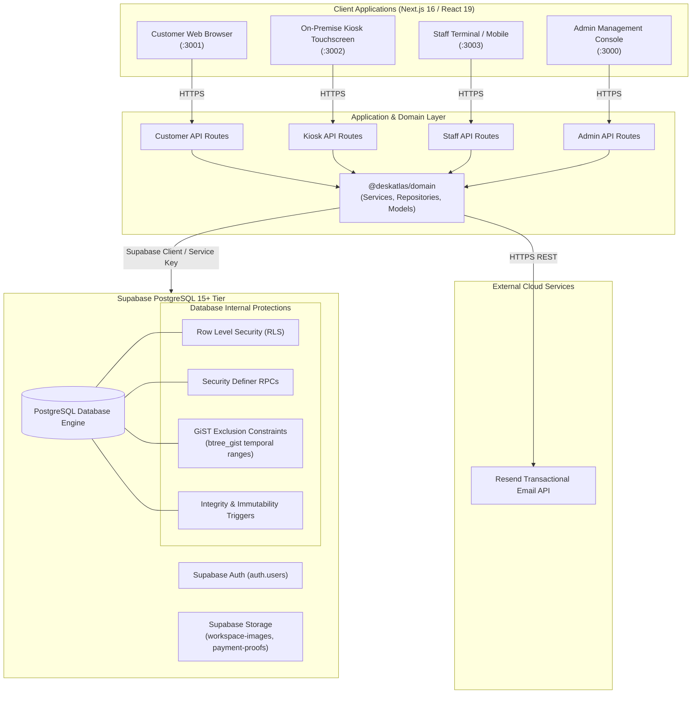
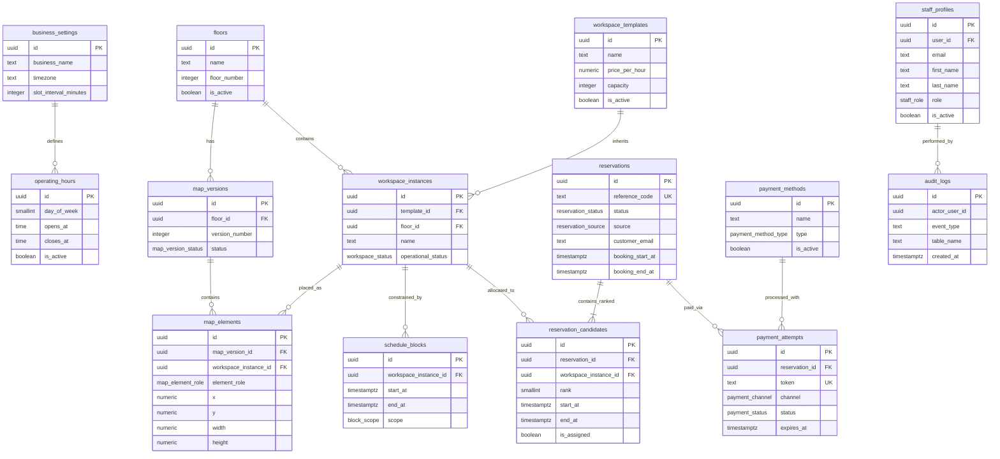
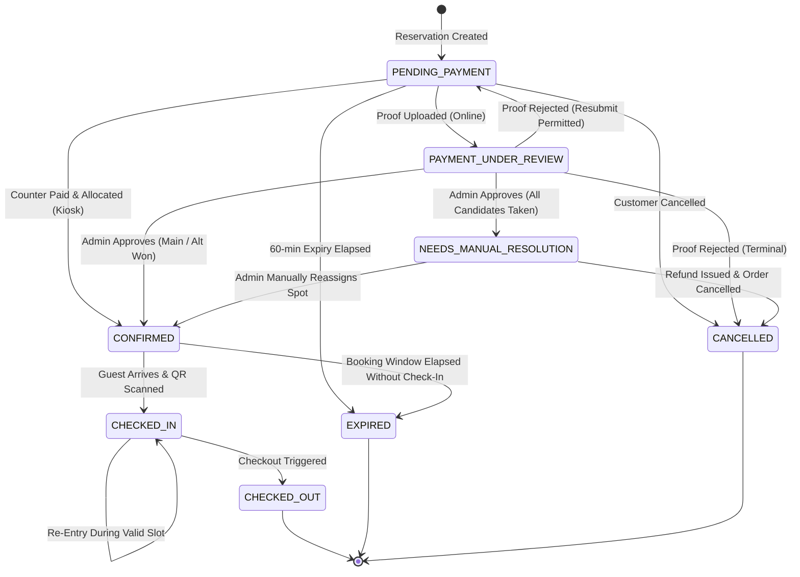
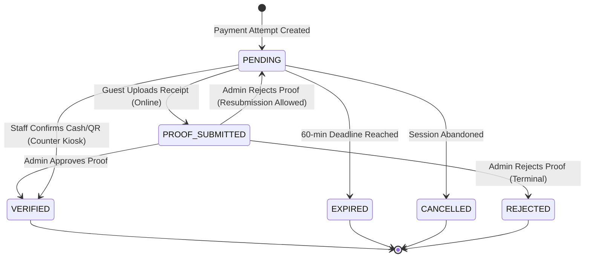

# DeskAtlas — Industry-Standard Project Technical Documentation (AS-BUILT)

**Template Type:** Official As-Built Engineering Document  
**Document Classification:** System Architecture, Database Schema, Security & Operational Reference  
**Project Name:** DeskAtlas Coworking Space Reservation & Operations Management System  
**Audited Commit:** `c0a2e8e66cb5ba64d1e2ab52072f2010bd123d38`  
**Audited Branch:** `cleanup` (Synchronized with `main` & `dev`)  
**Target Runtime:** Node.js 20+, pnpm 9.15.0, Next.js 16.3.2 (React 19.2.8), PostgreSQL 15+ (Supabase)  
**Primary Test Gate:** Vitest 5.0.0 (12/12 Test Suites Passing, 36/36 Tests Verified)  

---

## 1. Document Control

| Attribute | Specification / Audit Record |
|---|---|
| **Project Name** | DeskAtlas — Coworking Space Reservation & Operations Management System |
| **Document Title** | DeskAtlas Official As-Built System Architecture & Technical Project Documentation |
| **Version** | 1.0.0 (As-Built Release Candidate) |
| **Status** | Approved & Complete (All Milestones M01–M17 & MF-01–MF-42 Verified) |
| **Date of Audit** | September 6, 2026 |
| **Inspected Git Commit** | `c0a2e8e66cb5ba64d1e2ab52072f2010bd123d38` |
| **Inspected Git Branch** | `cleanup` (Merged to `main` / `dev`) |
| **Authors / Maintainers** | DeskAtlas Engineering Team & System Architects |
| **Authoritative Specifications** | 1. `docs/DeskAtlas_Final_Source_of_Truth_Project_Plan.md`<br>2. `docs/prd-deskatlas.md`<br>3. `docs/DeskAtlas_Final_ERD_Specification.md`<br>4. `docs/DeskAtlas_Backend_Integration_Scope_of_Work.md`<br>5. `docs/DeskAtlas_Feature_Milestone_Runbook.md`<br>6. `docs/DeskAtlas_Technical_Defense_Handbook_AS_BUILT.md` |
| **Last Verified Date** | September 6, 2026 |

---

## 2. Purpose and Audience

### 2.1 System Purpose
DeskAtlas is an integrated, multi-portal coworking space management platform engineered around a **server-authoritative, zero-inventory-hold reservation model**. Built on Next.js 16 and Supabase PostgreSQL 15+, it addresses the fundamental challenge of managing coworking desk inventory in environments reliant on manual, asynchronous, peer-to-peer payment verification (e.g., GCash, Maya, manual bank transfers). Instead of locking physical desks during browsing or proof verification (which induces inventory starvation and abandoned checkouts), DeskAtlas accepts multi-candidate preferences (Main choice and up to two alternative backup spots/times) and commits inventory atomically only upon verified administrative or front-desk confirmation.

### 2.2 Scope of this Document
This document is the official, comprehensive technical as-built engineering reference for the DeskAtlas codebase. It captures the concrete implementation state across all 4 frontend applications, shared domain packages, PostgreSQL schema, RLS policies, stored procedures, transaction boundaries, and automated test suites.

### 2.3 Intended Readers
- **New Engineers & Maintainers:** Comprehensive architecture, code symbol references, and onboarding workflow.
- **QA Engineers & Testers:** Test matrix, test suite inventory (`t01`–`t12`), and verification runbooks.
- **Security Auditors & System Architects:** Threat models, RLS policies, secret segregation, and GiST concurrency mechanics.
- **Capstone Panelists & Technical Advisers:** Authoritative evidence of software engineering rigor, normalization, and operational completeness.
- **DevOps & Site Reliability Engineers:** Migration protocols, operational runbooks, and incident response procedures.

### 2.4 What This Document Does Not Replace
This document reflects the **as-built code implementation**. It does not replace the product roadmap or future commercial feature requests. Where discrepancies exist between early conceptual PRD text and the final locked engineering specifications, those items are formally identified in the Mismatch and Limitation registers.

---

## 3. Scope

### 3.1 Current Capstone Scope
The active DeskAtlas capstone implementation encompasses an end-to-end, multi-actor operational suite consisting of four specialized web applications communicating with a shared Supabase PostgreSQL backend.

### 3.2 In-Scope Capabilities
- **Customer Web Portal:** Public interactive floor plan browsing (Konva canvas), template-first spot selection, minute-precision calendar booking, multi-rank candidate reservation submissions, 60-minute payment countdown session, receipt/proof upload to private storage, reference code booking tracker, and opaque QR access pass display.
- **On-Site Kiosk Terminal:** High-resolution touch interface, instant "Now Reserve" workflow, "You Are Here" spatial orientation markers, on-site counter cash/QR code generation, and rapid session reset.
- **Front-Desk Staff Dashboard:** Today's occupancy dashboard, active check-in/out roster, physical camera QR code scanner (`html5-qrcode`), real-time check-in and re-entry validation, kiosk counter payment confirmation queue, and read-only interactive floor map.
- **Administrative Back-Office Console:** Interactive 2D Konva Floor Plan Designer with collision detection, structural wall alignment, and amenity icon placement; multi-version draft/publish map pipeline; workspace template and instance lifecycle management; online payment proof verification queues; staff account provisioning and deactivation; operational schedule and business hours management; and reporting engines with Excel (`.xlsx`) and CSV exports.

### 3.3 Explicit Non-Goals & Excluded Features
- **Direct Payment Gateway Webhooks:** Automated credit card processing and payment gateway callback hooks (Stripe, PayMongo, Xendit) are excluded; the system is explicitly designed for human-in-the-loop manual receipt verification.
- **Customer Authentication Accounts:** Customers book as unauthenticated guests; no customer user accounts, customer passwords, or customer profile dashboards exist.
- **Policy Document Management:** Uploading, versioning, or managing PDF policy agreements was formally classified as Won't-Have in the locked project specification (`docs/DeskAtlas_Final_Source_of_Truth_Project_Plan.md`).
- **Inventory Holds During Checkout:** DeskAtlas explicitly forbids holding or locking physical inventory prior to administrative payment verification.

---

## 4. System Context Diagram



---

## 5. Architectural Overview

DeskAtlas adopts a modular monorepo architecture with clean layer separation:
1. **Presentation Layer (Apps):** Four discrete Next.js 16 applications tailored to specific user contexts. Presentation logic is completely separated from domain entities.
2. **Domain & Service Layer (`packages/domain`):** Pure TypeScript business logic implementing the Repository pattern. Repositories provide abstract interfaces with dual implementations: live Supabase database drivers and memory drivers for rapid isolated unit testing.
3. **Database & Persistence Tier (PostgreSQL / Supabase):** Serves as the ultimate authority for state transitions, concurrency boundaries, and data integrity. Multi-rank reservation allocation occurs strictly inside atomic PostgreSQL stored procedures with serial row locks (`FOR UPDATE`) and GiST exclusion constraints (`btree_gist`).
4. **Storage Tier:** S3-compatible Supabase Storage with strict public/private bucket segmentation. Payment proofs are stored in a private bucket accessible only by authorized administrators via signed URLs.
5. **Notification Tier:** Asynchronous transactional email dispatch powered by the Resend REST API adapter.

---

## 6. Technology Stack

| Technology | Exact Version | Purpose | Where Used | Reason |
|---|---|---|---|---|
| **Next.js** | `^16.3.2` | Application framework, App Router, API routes | `apps/*` (All 4 applications) | Server components, API colocation, edge runtime readiness, robust production builds. |
| **React** | `^19.2.8` | UI component runtime library | Monorepo-wide | Concurrency primitives, modern hook architecture, seamless Next.js 16 integration. |
| **TypeScript** | `^5.6.3` | Static typing and interface contracts | Monorepo-wide | Prevents property drift, enforces database DTO contracts across packages. |
| **pnpm** | `9.15.0` | Monorepo package manager & workspace orchestrator | Root workspace | Strict dependency isolation, symlinked node_modules, rapid workspace builds. |
| **Supabase JS Client** | `^2.112.4` | Data layer client for PostgreSQL, Auth, & Storage | `packages/domain`, `apps/*/src/app/api` | Native PostgreSQL connection pooling, typed RPC invoker, RLS context. |
| **PostgreSQL** | `15+` | Relational database & concurrency engine | Database tier (`supabase/`) | ACID compliance, `tstzrange` GiST exclusion constraints, PL/pgSQL procedures. |
| **Tailwind CSS** | `4.1.12` | Design tokens and utility styling | All 4 client apps | Zero-runtime CSS extraction, modern responsive utilities, design system tokens. |
| **Konva / React-Konva** | `^18.2.10` / `9.3.18` | 2D HTML5 Canvas rendering engine | `admin-portal`, `customer-website`, `kiosk` | Hardware-accelerated 2D canvas rendering with rich shape transforms, drag/drop, zoom/pan. |
| **Radix UI Primitives** | `^1.1.x`–`^2.2.x` | Accessible headless UI components | `apps/*/src/components` | WCAG-compliant dialogs, popovers, dropdowns, and tabs styled via custom tokens. |
| **html5-qrcode** | `^2.3.8` | WebRTC camera QR code scanner | `staff-dashboard`, `kiosk` | Cross-platform client-side QR token parsing directly from video streams. |
| **jsqr** | `^1.4.0` | Fallback QR matrix decoder | `staff-dashboard` | Lightweight client-side pixel analysis for static and video feeds. |
| **ExcelJS** | `^4.4.0` | Spreadsheet workbook generation | `packages/domain` | Programmatic `.xlsx` operational report generation with styled headers and data formatting. |
| **pngjs** | `^7.0.0` | Low-level PNG bitmap rasterizer | `packages/domain` | Rendering server-side charts and data visualizations without headless browser overhead. |
| **Vitest** | `^5.0.0` | Unit & integration test runner | `tests/*` | Native ESM support, high execution speed, zero-config TypeScript compatibility. |
| **Lucide React** | `0.487.0` | System icon library | All 4 client apps | Consistent visual grammar and amenity icon representation across portals. |

---

## 7. Dependency Inventory

### 7.1 Direct Runtime Dependencies
- `@supabase/supabase-js`: Official Supabase client for query execution, stored procedure calls, and storage manipulation.
- `exceljs`: Used in `packages/domain/src/services/excelReportBuilder.ts` to generate formatted Excel spreadsheets for administrative export.
- `pngjs`: Used in `packages/domain/src/services/chartRenderer.ts` for headless chart generation in offline report pipelines.
- `konva` & `react-konva`: Canvas rendering engine for floor plans, desks, structural walls, and zoom/pan viewports.
- `html5-qrcode` & `jsqr`: Client-side camera QR scanning for front-desk staff check-in and kiosk lookup.
- `radix-ui/*`: Unstyled, accessible UI building blocks (dialogs, dropdowns, tooltips, select menus).
- `date-fns`: Date arithmetic, time slot incrementation, and business hours interval calculation.
- `clsx` & `tailwind-merge`: Utility classes for conditional styling and Tailwind class conflict resolution.

### 7.2 Development Dependencies
- `typescript`: Type checking and compilation across packages.
- `vitest`: High-performance testing framework executing suites `t01` through `t12`.
- `@vitest/coverage-v8`: V8 code coverage instrumentation.
- `tailwindcss` & `@tailwindcss/postcss`: Modern Tailwind v4 build engine.

---

## 8. Repository Structure

```text
Desk-Atlas/
├── apps/
│   ├── admin-portal/          # Admin back-office console (Port 3000)
│   │   ├── src/app/           # Next.js App Router routes & API endpoints
│   │   └── src/components/    # Admin UI components, floor builder canvas, modals
│   ├── customer-website/      # Public guest booking & tracking portal (Port 3001)
│   │   ├── src/app/           # Routes: /, /reserve, /pay/[token], /track, /booking/[token]
│   │   └── src/features/      # Booking wizard, candidate selectors, payment proof upload
│   ├── kiosk/                 # On-site touchscreen terminal application (Port 3002)
│   │   ├── src/app/           # Routes: /, /kiosk/reserve, /kiosk/scanner
│   │   └── src/features/      # Instant "Now Reserve", counter code display, orientation
│   └── staff-dashboard/       # Front-desk operations console (Port 3003)
│       ├── src/app/           # Routes: /manage/dashboard, /manage/reservations, /manage/scan
│       └── src/components/    # QR camera scanner, check-in action drawer, payment review
├── packages/
│   ├── config/                # Shared ESLint, TypeScript, and PostCSS configurations
│   ├── domain/                # Core business logic, domain models, services, repositories
│   │   └── src/
│   │       ├── models/        # Database DTO interfaces and type definitions
│   │       └── services/      # Allocation, availability, map, payment, reporting services
│   ├── ui/                    # Reusable design system primitives (buttons, inputs, cards)
│   └── validation/            # Shared runtime validators, regex patterns, input schemas
├── supabase/                  # Authoritative PostgreSQL migrations and seed scripts
│   ├── 000_reset_database.sql # Full schema teardown and reset script
│   ├── 001_schema.sql         # Tables, constraints, enums, indexes, and triggers
│   ├── 002_functions.sql      # PL/pgSQL RPCs: allocation, payment, QR verification
│   ├── 003_storage.sql        # Storage buckets and S3 access policies
│   ├── 004_security_and_rls.sql # RLS policies, security-definer helper functions
│   ├── 005_seed_admin.sql     # Initial admin bootstrap credentials
│   ├── 006_seed_staff.sql     # Front-desk staff seed data
│   ├── 011_landing_preview_photos.sql # Landing page preview asset seed
│   └── 012_performance_indexes.sql   # High-concurrency composite B-tree indexes
├── tests/                     # Vitest automated test suites (t01 through t12)
├── docs/                      # Authoritative specifications, PRDs, runbooks, and ledgers
├── package.json               # Root monorepo scripts and dependencies
└── pnpm-workspace.yaml        # Workspace configuration linking apps and packages
```

---

## 9. Build and Local Development

### 9.1 Runtime Prerequisites
- **Node.js:** v20.10.0 or higher
- **Package Manager:** `pnpm` v9.15.0 (`corepack enable && corepack prepare pnpm@9.15.0 --activate`)
- **Database Engine:** Supabase PostgreSQL instance (Local Docker or Supabase Cloud)

### 9.2 Setup Commands
```bash
# 1. Clone repository
git clone https://github.com/deskatlas/Desk-Atlas.git
cd Desk-Atlas

# 2. Install workspace dependencies
pnpm install

# 3. Configure environment variables
cp .env.example .env.local

# 4. Bootstrap Administrator & Staff credentials
pnpm bootstrap:admin
pnpm bootstrap:staff

# 5. Run all 4 applications concurrently
pnpm dev

# Or run individual applications
pnpm dev:admin     # http://localhost:3000
pnpm dev:customer  # http://localhost:3001
pnpm dev:kiosk     # http://localhost:3002
pnpm dev:staff     # http://localhost:3003
```

### 9.3 Build, Lint, and Typecheck Commands
```bash
# Typecheck all packages and apps
pnpm typecheck

# Lint workspace
pnpm lint

# Production build for all apps
pnpm build
```

---

## 10. Environment Variables

| Variable | Scope | Required | Purpose | Secret? |
|---|---|---|---|---|
| `NEXT_PUBLIC_SUPABASE_URL` | Client & Server | Yes | Supabase project URL endpoint | No |
| `NEXT_PUBLIC_SUPABASE_ANON_KEY` | Client & Server | Yes | Public Supabase anon key for client queries | No |
| `SUPABASE_SERVICE_ROLE_KEY` | Server Only | Yes | Administrative service role key for backend RPCs | **YES** |
| `RESEND_API_KEY` | Server Only | Yes | API authorization key for Resend transactional email | **YES** |
| `RESEND_FROM_EMAIL` | Server Only | Yes | Verified sender email address for system emails | No |
| `TRANSACTIONAL_EMAIL_WEBHOOK_URL` | Server Only | No | Optional webhook endpoint for email delivery tracking | No |
| `ADMIN_EMAIL` | Script Only | Yes | Seed administrator email address | No |
| `ADMIN_PASSWORD` | Script Only | Yes | Initial bootstrap password for seed admin | **YES** |
| `ADMIN_DISPLAY_NAME` | Script Only | No | Initial display name for seed admin | No |

---

## 11. Route Reference

### 11.1 Customer Website (`@deskatlas/customer-website` — Port 3001)
| Route | Actor | Component / Page | Auth | Purpose |
|---|---|---|---|---|
| `/` | Public Guest | `src/app/page.tsx` | None | Landing page with published floor map preview carousel. |
| `/reserve` | Public Guest | `src/app/reserve/page.tsx` | None | Template-first, map-based multi-candidate reservation booking. |
| `/pay/[token]` | Public Guest | `src/app/pay/[token]/page.tsx` | Token | 60-minute payment countdown session, QR display, proof upload. |
| `/track` | Public Guest | `src/app/track/page.tsx` | None | Guest reference code + email lookup for reservation tracking. |
| `/booking/[token]` | Confirmed Guest | `src/app/booking/[token]/page.tsx` | Token | Live timed QR booking access pass and check-in voucher. |

### 11.2 Kiosk Application (`@deskatlas/kiosk` — Port 3002)
| Route | Actor | Component / Page | Auth | Purpose |
|---|---|---|---|---|
| `/` | Walk-in Guest | `src/app/page.tsx` | None | Fullscreen touch welcome screen and kiosk launcher. |
| `/kiosk/reserve` | Walk-in Guest | `src/app/kiosk/reserve/page.tsx` | None | Instant "Now Reserve" flow, spot selection, counter payment code. |
| `/kiosk/scanner` | Walk-in Guest | `src/app/kiosk/scanner/page.tsx` | None | Self-service on-site QR scanner for check-in verification. |

### 11.3 Staff Dashboard (`@deskatlas/staff-dashboard` — Port 3003)
| Route | Actor | Component / Page | Auth | Purpose |
|---|---|---|---|---|
| `/` | Staff / Admin | `src/app/page.tsx` | None | Staff authentication login screen. |
| `/manage/dashboard` | Staff / Admin | `src/app/manage/page.tsx` | Staff Session | Operational dashboard: today's occupancy, active check-ins. |
| `/manage/reservations` | Staff / Admin | `src/app/manage/reservations/page.tsx` | Staff Session | Operational roster of today's confirmed reservations. |
| `/manage/scan` | Staff / Admin | `src/app/manage/scan/page.tsx` | Staff Session | WebRTC camera QR scanner for check-in and re-entry validation. |
| `/manage/kiosk-confirm` | Staff / Admin | `src/app/manage/kiosk-confirm/page.tsx` | Staff Session | Queue to confirm walk-in kiosk counter cash/QR payments. |
| `/manage/workspace-map` | Staff / Admin | `src/app/manage/workspace-map/page.tsx` | Staff Session | Live, read-only floor plan with active workspace statuses. |

### 11.4 Admin Portal (`@deskatlas/admin-portal` — Port 3000)
| Route | Actor | Component / Page | Auth | Purpose |
|---|---|---|---|---|
| `/` | Admin Only | `src/app/page.tsx` | None | Administrative login screen. |
| `/manage` | Admin Only | `src/app/manage/page.tsx` | Admin Session | Business performance analytics, revenue, and occupancy trends. |
| `/manage/payments` | Admin Only | `src/app/manage/payments/page.tsx` | Admin Session | Online payment proof verification and allocation review queue. |
| `/manage/workspaces` | Admin Only | `src/app/manage/workspaces/page.tsx` | Admin Session | Workspace templates and physical instances management. |
| `/manage/workspace-map` | Admin Only | `src/app/manage/workspace-map/page.tsx` | Admin Session | Interactive 2D Konva Floor Plan Designer and map publisher. |
| `/manage/reservations` | Admin Only | `src/app/manage/reservations/page.tsx` | Admin Session | Master reservation ledger, manual resolution, and cancellations. |
| `/manage/staff` | Admin Only | `src/app/manage/staff/page.tsx` | Admin Session | Staff user provisioning, editing, and deactivation. |
| `/manage/settings` | Admin Only | `src/app/manage/settings/page.tsx` | Admin Session | Operating hours, holiday closures, and payment method settings. |
| `/manage/reports` | Admin Only | `src/app/manage/reports/page.tsx` | Admin Session | Financial and operational reporting with Excel/CSV export. |

---

## 12. Actor and Permission Model

DeskAtlas enforces a four-tier role-based access control (RBAC) model:

| Capability / Entity | Anonymous Guest | Kiosk Station | Staff Member | Administrator | Enforcement Mechanism |
|---|---|---|---|---|---|
| Browse Floor Plan & Availability | Allowed | Allowed | Allowed | Allowed | `p_map_versions_public_published_read`, `availabilityService` |
| Submit Online Reservation | Allowed | Denied | Denied | Denied | `create_web_reservation_with_payment_session` RPC |
| Submit Kiosk Reservation | Denied | Allowed | Denied | Denied | `create_kiosk_reservation_with_counter_payment` RPC |
| Upload Payment Proof | Allowed (Token) | Denied | Denied | Denied | `submit_web_payment_proof` RPC & `p_storage_proofs_guest_insert` |
| View Customer Booking Pass & QR | Allowed (Token) | Denied | Allowed | Allowed | Token hash validation (`bookingAccessService`) |
| Scan QR / Check-In / Re-Entry | Denied | Denied | Allowed | Allowed | `check_in_reservation` & `check_out_reservation` RPCs |
| Confirm Kiosk Counter Payment | Denied | Denied | Allowed | Allowed | `confirm_kiosk_payment_and_allocate` RPC |
| Approve Online Payment Proof | Denied | Denied | **DENIED** | Allowed | `approve_online_payment_and_allocate` RPC (`is_admin()` check) |
| Reject Online Payment Proof | Denied | Denied | **DENIED** | Allowed | `reject_online_payment_attempt` RPC (`is_admin()` check) |
| Manual Resolution of Conflicts | Denied | Denied | **DENIED** | Allowed | `p_reservations_admin_all` RLS & `adminReservationService` |
| Draft / Publish Floor Maps | Denied | Denied | **DENIED** | Allowed | `publish_map_version` RPC & `p_map_versions_admin_all` |
| Workspace Template / Instance CRUD | Denied | Denied | **DENIED** | Allowed | `p_workspace_templates_admin_write` RLS |
| Toggle Instance Operational Status | Denied | Denied | Allowed | Allowed | `p_workspace_instances_staff_update` RLS |
| Manage Staff Accounts | Denied | Denied | **DENIED** | Allowed | `admin_create_staff`, `admin_update_staff` RPCs |
| Modify Business Settings & Hours | Denied | Denied | **DENIED** | Allowed | `p_settings_admin_write_*` RLS |

---

## 13. Customer Functional Flow

The Customer reservation lifecycle follows a linear pipeline:
1. **Landing Page (`/`):** Guest views published floor plan carousel and template offerings.
2. **Template Selection & Spot Picking (`/reserve`):** Guest selects a workspace tier (e.g., Dedicated Desk, Private Office). The interactive Konva canvas filters available spots for the selected date and time duration.
3. **Backup Candidate Selection:** Guest optionally selects Alternative 1 and Alternative 2. Validation enforces that alternatives belong to the identical workspace template, date, and duration.
4. **Guest Details Ingestion:** Guest enters First Name, Last Name, and Email Address.
5. **Session Initiation:** Frontend invokes `/api/reservations`, executing `create_web_reservation_with_payment_session`. This creates:
   - `reservations` record (`status = 'PENDING_PAYMENT'`).
   - Up to 3 `reservation_candidates` records (`is_assigned = false`).
   - `payment_attempts` record with an unguessable 64-character token and a strict 60-minute expiry (`expires_at = now() + interval '1 hour'`).
6. **Payment Proof Submission (`/pay/[token]`):** Guest views payment instructions (GCash/Maya QR), uploads receipt image to `payment-proofs` bucket, and submits transaction reference number. Stored procedure `submit_web_payment_proof` transitions payment attempt to `PROOF_SUBMITTED` and reservation to `PAYMENT_UNDER_REVIEW`.
7. **Confirmation & Access Pass (`/booking/[token]`):** Upon administrative approval and successful atomic allocation, the guest receives a confirmation email containing their booking link, unlocking their live QR access pass.

---

## 14. Kiosk Functional Flow

The on-site Kiosk application (`@deskatlas/kiosk`) streamlines walk-in bookings:
1. **Idle / Welcome Screen (`/`):** Fullscreen animated welcome prompt. Tapping starts the session.
2. **Instant "Now Reserve" (`/kiosk/reserve`):** Pre-configures the booking start time to the current clock time rounded to the next operational slot.
3. **Floor Map Orientation:** The Konva map displays a distinct "You Are Here" orientation pin indicating the kiosk's physical station.
4. **Candidate Selection & Guest Input:** Walk-in guest inputs first name, last name, and email.
5. **Counter Payment Initiation:** Frontend invokes `create_kiosk_reservation_with_counter_payment`. A payment attempt is generated with channel `COUNTER` and a human-readable 6-character payment code.
6. **Front-Desk Handoff:** Kiosk displays the payment code and instructs the guest to pay via cash or counter QR at the reception desk.
7. **Auto-Reset:** The kiosk terminal automatically clears state and resets to the welcome screen after 45 seconds of inactivity.

---

## 15. Staff Functional Flow

Front-desk staff members utilize `@deskatlas/staff-dashboard`:
1. **Authentication:** Staff log in at `/` via email and password validated by `verify_staff_login` RPC.
2. **Operational Dashboard (`/manage/dashboard`):** Real-time display of today's occupancy percentage, incoming check-ins, active in-facility guests, and pending counter payments.
3. **Counter Payment Verification (`/manage/kiosk-confirm`):** Front-desk staff search by the customer's 6-character kiosk payment code, collect cash or scan on-site QR, and trigger `confirm_kiosk_payment_and_allocate` RPC.
4. **QR Code Scanning & Access Validation (`/manage/scan`):** Staff use device cameras to scan customer booking QR tokens. Stored procedure `check_in_reservation` validates the token hash against the active reservation window:
   - If before start time: Access Denied (Too Early).
   - If after end time: Access Denied (Expired).
   - If within window: Access Granted (Status transitions to `CHECKED_IN` or logs Re-Entry).
5. **Check-Out (`/manage/reservations`):** Staff trigger check-out when the customer vacates the premises, setting reservation status to `CHECKED_OUT`.
6. **Operational Status Overrides (`/manage/workspace-map`):** Staff can toggle an individual desk to `MAINTENANCE` in real time if equipment is damaged.

---

## 16. Admin Functional Flow

Administrators access the full suite of management tools in `@deskatlas/admin-portal`:
1. **Payment Proof Verification (`/manage/payments`):** Admin inspects uploaded payment receipts via secure signed URLs. Approving triggers `approve_online_payment_and_allocate`; rejecting invokes `reject_online_payment_attempt` with a mandatory audit reason.
2. **2D Map Builder (`/manage/workspace-map`):** Drag-and-drop Konva editor to create, move, rotate, and align desks, rooms, walls, amenities, and structural boundaries. Admins can save drafts and execute `publish_map_version` to make floor layouts live instantly across all portals.
3. **Workspace Catalog Management (`/manage/workspaces`):** CRUD operations for workspace templates (name, hourly/daily pricing, capacity, amenity tags, photo upload) and physical instances.
4. **Staff Account Management (`/manage/staff`):** Provisioning new staff credentials, modifying permissions, or deactivating departed employees via `admin_create_staff` and `admin_update_staff`.
5. **Operating Hours & Schedule Blocks (`/manage/settings`):** Defining regular opening/closing hours per weekday and setting global or spot-specific holiday/maintenance closures.
6. **Financial & Operational Reports (`/manage/reports`):** Querying historical revenue, occupancy rates, and peak utilization across customizable date ranges, with instant export to formatted Excel (`.xlsx`) or CSV.

---

## 17. Frontend Architecture

### 17.1 Monorepo Application Composition
Each application in `apps/` is a Next.js 16 App Router project leveraging React 19 Server and Client Components.
- **`apps/admin-portal`:** Heavy client-side interactivity for canvas manipulation and administrative workflows.
- **`apps/customer-website`:** SSR-optimized landing page, client-side booking stepper, dynamic SVG/Canvas viewports.
- **`apps/kiosk`:** Touch-optimized UI with kiosk session timers and fullscreen hardware lockouts.
- **`apps/staff-dashboard`:** Mobile-responsive terminal optimized for rapid single-tap actions and camera streaming.

### 17.2 State Management & Data Fetching
- **Server Communication:** Next.js Route Handlers (`src/app/api/*`) act as backend-for-frontend (BFF) proxies calling domain services.
- **Client State:** Local React state (`useState`, `useReducer`) combined with customized hooks (`useAvailability`, `usePublishedMap`, `usePaymentSession`).
- **Form Handling:** Controlled components paired with domain validation rules from `@deskatlas/validation`.

---

## 18. Interactive Map Architecture

The DeskAtlas interactive map subsystem is built on **Konva** and **React-Konva**:
- **Renderer Engine:** Hardware-accelerated 2D HTML5 canvas capable of rendering hundreds of vector shapes at 60 FPS.
- **Coordinate System:** Absolute 2D Cartesian plane `(x, y)` relative to floor boundaries `(0, 0, width, height)`.
- **Z-Index Layering:** Strict relational z-index ordering:
  1. Floor outline and background grid (`z_index = 0`).
  2. Structural elements (Walls, Columns, Doors, Restrooms, Amenities) (`z_index = 10–50`).
  3. Physical workspace instances (Desks, Private Offices, Meeting Tables) (`z_index = 100+`).
  4. Selection overlays, transformer handles, and "You Are Here" pins (`z_index = 999+`).
- **Snapping & Alignment Guides:** Admin map builder includes magnetic grid snapping (10px increments) and bounding-box collision detection.
- **Viewport Controls:** Smooth pinch-to-zoom, mousewheel zoom clamping (`0.5x` to `3.0x`), and touch panning with boundaries locked to canvas limits.

---

## 19. Backend / Service Architecture

DeskAtlas implements a decoupled Service-Repository pattern within `packages/domain`:
- **Repository Interface:** Standardized contracts defining data access boundaries (e.g., `ReservationRepository`, `MapRepository`, `SettingsRepository`).
- **Supabase Repositories (`*SupabaseRepository.ts`):** Production data adapters communicating with PostgreSQL via the `@supabase/supabase-js` client.
- **Memory Repositories (`*MemoryRepository.ts`):** High-speed in-memory implementations used by automated test suites for deterministic execution without database roundtrips.
- **Domain Services (`*Service.ts`):** Orchestrates business workflows, coordinates multiple repositories, enforces domain invariants, and triggers notifications.
- **Error Normalization:** Standardized error mapping converting PostgreSQL constraint errors (e.g., `23P01 exclusion_violation`) into typed domain exceptions.

---

## 20. Database Overview

The persistence tier is powered by **PostgreSQL 15+** managed via Supabase.
- **Extensions Enabled:**
  - `pgcrypto`: Cryptographic random UUID generation (`gen_random_uuid()`) and SHA-256 token hashing.
  - `btree_gist`: Enables B-tree index semantics inside GiST indexes, allowing multi-column temporal exclusion constraints over UUIDs and timestamp ranges (`tstzrange`).
- **Database Role & Responsibility:** The database acts as the single source of truth and ultimate business rule validator. Transactions, exclusion constraints, triggers, and security-definer procedures prevent invalid states even if client applications are bypassed.

---

## 21. ERD (Entity Relationship Diagram)



---

## 22. Complete Data Dictionary

### Table: `staff_profiles`
- **Purpose:** Manages system users (Staff and Administrators) linked to Supabase Auth credentials.
- **Primary Key:** `id` (uuid)
- **Foreign Keys:** `user_id` -> `auth.users(id)` ON DELETE RESTRICT
- **Columns:**
  | Column | Type | Nullable | Default | Description |
  |---|---|---|---|---|
  | `id` | uuid | No | `gen_random_uuid()` | Internal surrogate identifier. |
  | `user_id` | uuid | No | None | Link to Supabase Auth account. |
  | `email` | text | No | None | Staff email address (Unique). |
  | `first_name` | text | No | None | Given name. |
  | `last_name` | text | No | None | Surname. |
  | `role` | staff_role | No | `'STAFF'` | Role: `'ADMIN'` or `'STAFF'`. |
  | `is_active` | boolean | No | `true` | Active status indicator. |
  | `created_at` | timestamptz | No | `now()` | Record creation timestamp. |
  | `updated_at` | timestamptz | No | `now()` | Record last updated timestamp. |
- **Constraints:** `staff_profiles_email_key` UNIQUE (`email`), `staff_profiles_user_id_key` UNIQUE (`user_id`).
- **Indexes:** `idx_staff_profiles_role_active` (`role`, `is_active`).
- **Triggers:** `trg_staff_profiles_updated_at`.
- **RLS Policies:** `p_staff_profiles_admin_all` (Admin full access), `p_staff_profiles_self_read` (Staff self read).
- **Read Actors:** Admin, Staff (Self).
- **Write Actors:** Admin.
- **Delete Behavior:** Soft deactivation via `is_active = false`.
- **Used By Code:** `authService.ts`, `staffManagementService.ts`, `verify_staff_login`.
- **Related Tests:** `t11-auth-and-security.test.ts`.

### Table: `business_settings`
- **Purpose:** Stores global venue operating configuration (timezone, slot granularity, booking rules).
- **Primary Key:** `id` (uuid)
- **Foreign Keys:** None.
- **Columns:**
  | Column | Type | Nullable | Default | Description |
  |---|---|---|---|---|
  | `id` | uuid | No | `gen_random_uuid()` | Singleton settings identifier. |
  | `business_name` | text | No | None | Public brand name of the venue. |
  | `timezone` | text | No | `'Asia/Manila'` | IANA timezone string. |
  | `slot_interval_minutes`| integer | No | `60` | Reservation granularity in minutes. |
  | `max_advance_booking_days`| integer| No | `30` | Horizon limit for future reservations. |
  | `min_booking_duration_hours`| integer| No| `1` | Minimum booking length. |
  | `max_booking_duration_hours`| integer| No| `12` | Maximum daily booking length. |
  | `created_at` | timestamptz | No | `now()` | Creation timestamp. |
  | `updated_at` | timestamptz | No | `now()` | Last update timestamp. |
- **Constraints:** `business_settings_singleton` CHECK (`id = '00000000-0000-0000-0000-000000000001'::uuid`).
- **Indexes:** None (single row).
- **Triggers:** `trg_business_settings_updated_at`, `trg_business_settings_timezone`.
- **RLS Policies:** `p_business_settings_read` (Public read), `p_settings_admin_write_business` (Admin write).
- **Read Actors:** Public, Staff, Admin.
- **Write Actors:** Admin.
- **Delete Behavior:** Deletion prohibited.
- **Used By Code:** `settingsService.ts`, `availabilityService.ts`.
- **Related Tests:** `t03-availability-business-hours.test.ts`.

### Table: `operating_hours`
- **Purpose:** Defines regular weekly schedule per weekday (0=Sunday to 6=Saturday).
- **Primary Key:** `id` (uuid)
- **Foreign Keys:** None.
- **Columns:**
  | Column | Type | Nullable | Default | Description |
  |---|---|---|---|---|
  | `id` | uuid | No | `gen_random_uuid()` | Identifier. |
  | `day_of_week` | smallint | No | None | Day index (0=Sunday, 6=Saturday). |
  | `opens_at` | time | No | None | Opening time. |
  | `closes_at` | time | No | None | Closing time. |
  | `is_active` | boolean | No | `true` | Whether open on this day. |
  | `created_at` | timestamptz | No | `now()` | Creation timestamp. |
  | `updated_at` | timestamptz | No | `now()` | Update timestamp. |
- **Constraints:** `operating_hours_day_valid` CHECK (`day_of_week BETWEEN 0 AND 6`), `operating_hours_time_valid` CHECK (`opens_at < closes_at`).
- **Indexes:** `idx_operating_hours_day_active` (`day_of_week`, `is_active`, `opens_at`).
- **Triggers:** `trg_operating_hours_updated_at`, `trg_operating_hours_no_overlap`.
- **RLS Policies:** `p_operating_hours_read` (Public read), `p_settings_admin_write_hours` (Admin write).
- **Read Actors:** Public, Staff, Admin.
- **Write Actors:** Admin.
- **Delete Behavior:** Hard delete permitted for reconfiguring schedule.
- **Used By Code:** `settingsService.ts`, `availabilityService.ts`.
- **Related Tests:** `t03-availability-business-hours.test.ts`.

### Table: `workspace_templates`
- **Purpose:** Abstract workspace categories/tiers defining baseline pricing, capacity, and features.
- **Primary Key:** `id` (uuid)
- **Foreign Keys:** None.
- **Columns:**
  | Column | Type | Nullable | Default | Description |
  |---|---|---|---|---|
  | `id` | uuid | No | `gen_random_uuid()` | Template identifier. |
  | `name` | text | No | None | Display name (e.g. Hot Desk, Private Office). |
  | `description` | text | Yes | None | Marketing and amenity description. |
  | `price_per_hour` | numeric | No | None | Default hourly rate (PHP). |
  | `capacity` | integer | No | `1` | Maximum occupant capacity. |
  | `photo_url` | text | Yes | None | Image asset URL. |
  | `is_active` | boolean | No | `true` | Operational status. |
  | `created_at` | timestamptz | No | `now()` | Creation timestamp. |
  | `updated_at` | timestamptz | No | `now()` | Update timestamp. |
- **Constraints:** `workspace_templates_price_positive` CHECK (`price_per_hour >= 0`), `workspace_templates_capacity_positive` CHECK (`capacity > 0`).
- **Indexes:** `idx_workspace_templates_active` (`is_active`).
- **Triggers:** `trg_workspace_templates_updated_at`.
- **RLS Policies:** `p_workspace_templates_public_read` (Public read active), `p_workspace_templates_admin_write` (Admin write).
- **Read Actors:** Public, Staff, Admin.
- **Write Actors:** Admin.
- **Delete Behavior:** Soft deactivation via `is_active = false`.
- **Used By Code:** `workspaceService.ts`, `reserve/page.tsx`.
- **Related Tests:** `t01-workspace-catalog.test.ts`.

### Table: `floors`
- **Purpose:** Represents distinct building levels/zones hosting workspace floor maps.
- **Primary Key:** `id` (uuid)
- **Foreign Keys:** None.
- **Columns:**
  | Column | Type | Nullable | Default | Description |
  |---|---|---|---|---|
  | `id` | uuid | No | `gen_random_uuid()` | Floor identifier. |
  | `name` | text | No | None | Floor title (e.g., 2nd Floor Mezzanine). |
  | `floor_number` | integer | No | None | Sorting index. |
  | `display_order` | integer | No | `0` | UI sequence order. |
  | `is_active` | boolean | No | `true` | Operational status. |
  | `created_at` | timestamptz | No | `now()` | Creation timestamp. |
  | `updated_at` | timestamptz | No | `now()` | Update timestamp. |
- **Constraints:** `floors_floor_number_unique` UNIQUE (`floor_number`).
- **Indexes:** `idx_floors_active_display` (`is_active`, `display_order`, `name`).
- **Triggers:** `trg_floors_updated_at`.
- **RLS Policies:** `p_floors_public_read` (Public read), `p_floors_admin_all` (Admin write).
- **Read Actors:** Public, Staff, Admin.
- **Write Actors:** Admin.
- **Delete Behavior:** Soft deactivation via `is_active = false`.
- **Used By Code:** `mapService.ts`, `workspaceService.ts`.
- **Related Tests:** `t02-map-persistence-geometry.test.ts`.

### Table: `workspace_instances`
- **Purpose:** Concrete physical desks, offices, and rooms placed on a specific floor.
- **Primary Key:** `id` (uuid)
- **Foreign Keys:** `template_id` -> `workspace_templates(id)`, `floor_id` -> `floors(id)`.
- **Columns:**
  | Column | Type | Nullable | Default | Description |
  |---|---|---|---|---|
  | `id` | uuid | No | `gen_random_uuid()` | Physical instance identifier. |
  | `template_id` | uuid | No | None | Inherited workspace template. |
  | `floor_id` | uuid | No | None | Assigned floor level. |
  | `name` | text | No | None | Physical label (e.g., Desk A-12). |
  | `operational_status` | workspace_status | No | `'ACTIVE'` | `'ACTIVE'`, `'MAINTENANCE'`, or `'RETIRED'`. |
  | `created_at` | timestamptz | No | `now()` | Creation timestamp. |
  | `updated_at` | timestamptz | No | `now()` | Update timestamp. |
- **Constraints:** `workspace_instances_floor_name_unique` UNIQUE (`floor_id`, `name`).
- **Indexes:** `idx_workspace_instances_template_status` (`template_id`, `operational_status`), `idx_workspace_instances_floor` (`floor_id`).
- **Triggers:** `trg_workspace_instances_updated_at`, `trg_workspace_instances_template_immutable`.
- **RLS Policies:** `p_workspace_instances_public_read` (Public read), `p_workspace_instances_staff_update` (Staff status update), `p_workspace_instances_admin_all` (Admin write).
- **Read Actors:** Public, Staff, Admin.
- **Write Actors:** Admin (Full), Staff (Operational status only).
- **Delete Behavior:** Status set to `'RETIRED'`.
- **Used By Code:** `workspaceService.ts`, `staffOperationsService.ts`.
- **Related Tests:** `t01-workspace-catalog.test.ts`.

### Table: `schedule_blocks`
- **Purpose:** Blackout windows for holidays, renovations, maintenance, or administrative holds.
- **Primary Key:** `id` (uuid)
- **Foreign Keys:** `workspace_instance_id` -> `workspace_instances(id)`.
- **Columns:**
  | Column | Type | Nullable | Default | Description |
  |---|---|---|---|---|
  | `id` | uuid | No | `gen_random_uuid()` | Block identifier. |
  | `workspace_instance_id`| uuid | Yes | None | Optional specific target desk. |
  | `start_at` | timestamptz | No | None | Start of blackout window. |
  | `end_at` | timestamptz | No | None | End of blackout window. |
  | `scope` | block_scope | No | `'GLOBAL'` | `'GLOBAL'`, `'TEMPLATE'`, or `'INSTANCE'`. |
  | `block_type` | block_type | No | `'MAINTENANCE'`| `'HOLIDAY'`, `'MAINTENANCE'`, `'PRIVATE_EVENT'`, `'ADMIN_HOLD'`. |
  | `reason` | text | Yes | None | Administrative explanation. |
  | `created_at` | timestamptz | No | `now()` | Creation timestamp. |
  | `updated_at` | timestamptz | No | `now()` | Update timestamp. |
- **Constraints:** `schedule_blocks_interval_valid` CHECK (`start_at < end_at`).
- **Indexes:** `idx_schedule_blocks_instance_window` (`workspace_instance_id`, `start_at`, `end_at`, `scope`), `idx_schedule_blocks_business_window` (`start_at`, `end_at`, `scope`).
- **Triggers:** None.
- **RLS Policies:** `p_schedule_blocks_read` (Public read), `p_settings_admin_write_blocks` (Admin write).
- **Read Actors:** Public, Staff, Admin.
- **Write Actors:** Admin.
- **Delete Behavior:** Hard delete permitted.
- **Used By Code:** `settingsService.ts`, `availabilityService.ts`.
- **Related Tests:** `t03-availability-business-hours.test.ts`.

### Table: `map_versions`
- **Purpose:** Floor plan versions supporting drafting, review, and live publishing.
- **Primary Key:** `id` (uuid)
- **Foreign Keys:** `floor_id` -> `floors(id)`.
- **Columns:**
  | Column | Type | Nullable | Default | Description |
  |---|---|---|---|---|
  | `id` | uuid | No | `gen_random_uuid()` | Version identifier. |
  | `floor_id` | uuid | No | None | Associated floor. |
  | `version_number` | integer | No | None | Monotonically increasing version counter. |
  | `status` | map_version_status | No | `'DRAFT'` | `'DRAFT'`, `'PUBLISHED'`, or `'ARCHIVED'`. |
  | `created_by` | uuid | Yes | None | Admin user ID who created version. |
  | `published_at` | timestamptz | Yes | None | Publishing timestamp. |
  | `version_notes` | text | Yes | None | Changelog notes. |
  | `created_at` | timestamptz | No | `now()` | Creation timestamp. |
  | `updated_at` | timestamptz | No | `now()` | Update timestamp. |
- **Constraints:** `map_versions_floor_version_unique` UNIQUE (`floor_id`, `version_number`).
- **Indexes:** `idx_map_versions_floor_status` (`floor_id`, `status`).
- **Triggers:** `trg_map_versions_updated_at`, `trg_map_versions_lifecycle`, `trg_map_versions_delete_guard`.
- **RLS Policies:** `p_map_versions_public_published_read` (Public reads published), `p_map_versions_admin_all` (Admin full access).
- **Read Actors:** Public (Published only), Staff, Admin.
- **Write Actors:** Admin.
- **Delete Behavior:** Draft versions can be deleted; published/archived versions are protected by trigger.
- **Used By Code:** `mapService.ts`, `publish_map_version`.
- **Related Tests:** `t02-map-persistence-geometry.test.ts`.

### Table: `map_elements`
- **Purpose:** Geometric shapes and spatial entities placed on a specific map version.
- **Primary Key:** `id` (uuid)
- **Foreign Keys:** `map_version_id` -> `map_versions(id)`, `workspace_instance_id` -> `workspace_instances(id)`.
- **Columns:**
  | Column | Type | Nullable | Default | Description |
  |---|---|---|---|---|
  | `id` | uuid | No | `gen_random_uuid()` | Shape element identifier. |
  | `map_version_id` | uuid | No | None | Parent map version. |
  | `workspace_instance_id`| uuid | Yes | None | Linked physical desk (if element is interactive). |
  | `element_role` | map_element_role | No | None | `'DESK'`, `'ROOM'`, `'WALL'`, `'DOOR'`, `'RESTROOM'`, `'AMENITY'`. |
  | `label` | text | Yes | None | Visual map text label. |
  | `x` | numeric | No | None | X-coordinate on canvas. |
  | `y` | numeric | No | None | Y-coordinate on canvas. |
  | `width` | numeric | No | None | Width on canvas. |
  | `height` | numeric | No | None | Height on canvas. |
  | `rotation` | numeric | No | `0` | Rotation angle in degrees (0–360). |
  | `z_index` | integer | No | `0` | Visual display stack layer. |
  | `color` | text | Yes | None | Hex fill color. |
  | `icon` | text | Yes | None | Lucide icon name. |
  | `created_at` | timestamptz | No | `now()` | Creation timestamp. |
  | `updated_at` | timestamptz | No | `now()` | Update timestamp. |
- **Constraints:** `map_elements_dimensions_positive` CHECK (`width > 0 AND height > 0`).
- **Indexes:** `idx_map_elements_version_zindex` (`map_version_id`, `z_index`), `idx_map_elements_instance` (`workspace_instance_id`).
- **Triggers:** `trg_map_elements_updated_at`, `trg_map_elements_integrity`.
- **RLS Policies:** `p_map_elements_public_read` (Public read for published map elements), `p_map_elements_admin_all` (Admin write).
- **Read Actors:** Public, Staff, Admin.
- **Write Actors:** Admin.
- **Delete Behavior:** Cascaded when draft version is deleted.
- **Used By Code:** `mapService.ts`, `publishedMapSupabaseRepository.ts`.
- **Related Tests:** `t02-map-persistence-geometry.test.ts`.

### Table: `reservations`
- **Purpose:** Primary booking order record storing customer identity, status, and lifecycle times.
- **Primary Key:** `id` (uuid)
- **Foreign Keys:** None.
- **Columns:**
  | Column | Type | Nullable | Default | Description |
  |---|---|---|---|---|
  | `id` | uuid | No | `gen_random_uuid()` | Reservation order identifier. |
  | `reference_code` | text | No | `generate_reservation_reference()` | Public booking tracking code (e.g., DA-20260906-ABCD). |
  | `source` | reservation_source | No | `'ONLINE'` | `'ONLINE'` or `'KIOSK'`. |
  | `status` | reservation_status | No | `'PENDING_PAYMENT'` | State machine status. |
  | `customer_first_name` | text | No | None | Customer given name. |
  | `customer_last_name` | text | No | None | Customer surname. |
  | `customer_email` | text | No | None | Customer notification email. |
  | `booking_start_at` | timestamptz | No | None | Confirmed booking start time. |
  | `booking_end_at` | timestamptz | No | None | Confirmed booking end time. |
  | `qr_token_hash` | text | Yes | None | SHA-256 hash of active booking QR token. |
  | `checked_in_at` | timestamptz | Yes | None | First check-in timestamp. |
  | `checked_out_at` | timestamptz | Yes | None | Final check-out timestamp. |
  | `notes` | text | Yes | None | Administrative or resolution notes. |
  | `created_at` | timestamptz | No | `now()` | Creation timestamp. |
  | `updated_at` | timestamptz | No | `now()` | Update timestamp. |
- **Constraints:** `reservations_reference_code_key` UNIQUE (`reference_code`), `reservations_interval_valid` CHECK (`booking_start_at < booking_end_at`).
- **Indexes:** `idx_reservations_status_created` (`status`, `created_at` DESC), `idx_reservations_reference_code` (`reference_code`).
- **Triggers:** `trg_reservations_updated_at`, `trg_reservation_status_assignment_state`, `trg_reservations_core_immutable`, `trg_reservations_no_delete`.
- **RLS Policies:** `p_reservations_insert_guest` (Public insert), `p_reservations_staff_read` (Staff read), `p_reservations_admin_all` (Admin full access).
- **Read Actors:** Staff, Admin, Guest (via Reference Code + Email API verification).
- **Write Actors:** Guest (Insert only), Staff (Check-in/out), Admin (Full).
- **Delete Behavior:** Hard deletion forbidden by trigger.
- **Used By Code:** `reservationService.ts`, `bookingAccessService.ts`.
- **Related Tests:** `t04-reservation-validation-candidates.test.ts`, `t05-payment-session-and-review.test.ts`.

### Table: `reservation_candidates`
- **Purpose:** Stores ranked customer preferences (Main = Rank 0, Alt 1 = Rank 1, Alt 2 = Rank 2) and locks inventory via GiST exclusion when assigned.
- **Primary Key:** `id` (uuid)
- **Foreign Keys:** `reservation_id` -> `reservations(id)`, `workspace_instance_id` -> `workspace_instances(id)`.
- **Columns:**
  | Column | Type | Nullable | Default | Description |
  |---|---|---|---|---|
  | `id` | uuid | No | `gen_random_uuid()` | Candidate identifier. |
  | `reservation_id` | uuid | No | None | Parent reservation. |
  | `rank` | smallint | No | None | Preference rank (0=Main, 1=Alt 1, 2=Alt 2). |
  | `workspace_instance_id`| uuid | No | None | Physical desk instance. |
  | `start_at` | timestamptz | No | None | Requested slot start. |
  | `end_at` | timestamptz | No | None | Requested slot end. |
  | `is_assigned` | boolean | No | `false` | True if this candidate won atomic allocation. |
  | `created_at` | timestamptz | No | `now()` | Creation timestamp. |
  | `updated_at` | timestamptz | No | `now()` | Update timestamp. |
- **Constraints:**
  - `reservation_candidates_rank_valid` CHECK (`rank BETWEEN 0 AND 2`).
  - `reservation_candidates_interval_valid` CHECK (`start_at < end_at`).
  - `reservation_candidates_rank_unique` UNIQUE (`reservation_id`, `rank`).
  - `reservation_candidates_instance_time_unique` UNIQUE (`reservation_id`, `workspace_instance_id`, `start_at`).
  - **`reservation_candidates_no_assigned_overlap` EXCLUDE USING gist (`workspace_instance_id` WITH =, `tstzrange(start_at, end_at, '[)')` WITH &&) WHERE (`is_assigned = true`) DEFERRABLE INITIALLY IMMEDIATE.**
- **Indexes:** `idx_reservation_candidates_availability` (`workspace_instance_id`, `start_at`, `end_at`), `idx_reservation_candidates_assigned_window` (`start_at`, `end_at`, `is_assigned`), `idx_reservation_candidates_reservation_id` (`reservation_id`).
- **Triggers:** `trg_reservation_candidates_updated_at`, `trg_reservation_candidates_set_valid`, `trg_reservation_candidate_assignment_state`.
- **RLS Policies:** `p_candidates_insert_guest` (Public insert), `p_candidates_staff_read` (Staff read).
- **Read Actors:** Staff, Admin.
- **Write Actors:** Guest (Insert), Admin/Staff (via Allocation RPC).
- **Delete Behavior:** Deletion prohibited once confirmed.
- **Used By Code:** `reservationService.ts`, `approve_online_payment_and_allocate`.
- **Related Tests:** `t04-reservation-validation-candidates.test.ts`, `t05-payment-session-and-review.test.ts`.

### Table: `payment_methods`
- **Purpose:** Configured payment channels accepted by the venue (GCash, Maya, Bank Transfer, Counter Cash).
- **Primary Key:** `id` (uuid)
- **Foreign Keys:** None.
- **Columns:**
  | Column | Type | Nullable | Default | Description |
  |---|---|---|---|---|
  | `id` | uuid | No | `gen_random_uuid()` | Identifier. |
  | `name` | text | No | None | Display label (e.g., GCash Official QR). |
  | `type` | payment_method_type | No | None | Method enum: `'GCASH'`, `'MAYA'`, `'BANK_TRANSFER'`, `'CASH'`, `'COUNTER_QR'`. |
  | `instructions` | text | Yes | None | Payment guidelines shown to customer. |
  | `qr_code_url` | text | Yes | None | Public QR image URL. |
  | `is_active` | boolean | No | `true` | Active status indicator. |
  | `display_order` | integer | No | `0` | Sorting order. |
  | `created_at` | timestamptz | No | `now()` | Creation timestamp. |
  | `updated_at` | timestamptz | No | `now()` | Update timestamp. |
- **Constraints:** None.
- **Indexes:** None.
- **Triggers:** `trg_payment_methods_updated_at`.
- **RLS Policies:** `p_payment_methods_read` (Public read), `p_settings_admin_write_methods` (Admin write).
- **Read Actors:** Public, Staff, Admin.
- **Write Actors:** Admin.
- **Delete Behavior:** Soft deactivation via `is_active = false`.
- **Used By Code:** `settingsService.ts`, `pay/[token]/page.tsx`.
- **Related Tests:** `t05-payment-session-and-review.test.ts`.

### Table: `payment_attempts`
- **Purpose:** Tracks payment sessions, receipt uploads, proof verification, and expiration timers.
- **Primary Key:** `id` (uuid)
- **Foreign Keys:** `reservation_id` -> `reservations(id)`, `payment_method_id` -> `payment_methods(id)`.
- **Columns:**
  | Column | Type | Nullable | Default | Description |
  |---|---|---|---|---|
  | `id` | uuid | No | `gen_random_uuid()` | Attempt identifier. |
  | `reservation_id` | uuid | No | None | Linked reservation. |
  | `payment_method_id` | uuid | Yes | None | Selected payment method. |
  | `token` | text | No | None | Cryptographic session token (Unique). |
  | `channel` | payment_channel | No | `'ONLINE'` | `'ONLINE'` or `'COUNTER'`. |
  | `status` | payment_status | No | `'PENDING'` | `'PENDING'`, `'PROOF_SUBMITTED'`, `'VERIFIED'`, `'REJECTED'`, `'EXPIRED'`, `'CANCELLED'`. |
  | `proof_url` | text | Yes | None | S3 key in private `payment-proofs` bucket. |
  | `reference_number` | text | Yes | None | Customer-provided transaction reference code. |
  | `account_name` | text | Yes | None | Payer account name. |
  | `account_number` | text | Yes | None | Payer account number. |
  | `rejection_reason` | text | Yes | None | Admin explanation if proof is rejected. |
  | `expires_at` | timestamptz | No | None | Strict server timestamp when session expires. |
  | `verified_at` | timestamptz | Yes | None | Timestamp of admin/staff approval. |
  | `verified_by` | uuid | Yes | None | Staff/Admin user ID who approved. |
  | `created_at` | timestamptz | No | `now()` | Creation timestamp. |
  | `updated_at` | timestamptz | No | `now()` | Update timestamp. |
- **Constraints:** `payment_attempts_token_key` UNIQUE (`token`).
- **Indexes:** `idx_payment_attempts_token` (`token`), `idx_payment_attempts_reservation_status` (`reservation_id`, `status`).
- **Triggers:** `trg_payment_attempts_updated_at`, `trg_payment_attempts_business_rules`, `trg_payment_attempts_no_delete`.
- **RLS Policies:** `p_payment_attempts_insert_guest` (Public insert), `p_payment_attempts_staff_read` (Staff read), `p_payment_attempts_admin_all` (Admin full access).
- **Read Actors:** Public (via unguessable Token), Staff, Admin.
- **Write Actors:** Public (Proof submission), Admin (Approval/Rejection).
- **Delete Behavior:** Hard deletion forbidden by trigger.
- **Used By Code:** `paymentSessionService.ts`, `paymentReviewService.ts`.
- **Related Tests:** `t05-payment-session-and-review.test.ts`.

### Table: `audit_logs`
- **Purpose:** Immutable audit ledger tracking all critical business events and administrative actions.
- **Primary Key:** `id` (uuid)
- **Foreign Keys:** None.
- **Columns:**
  | Column | Type | Nullable | Default | Description |
  |---|---|---|---|---|
  | `id` | uuid | No | `gen_random_uuid()` | Audit event identifier. |
  | `actor_user_id` | uuid | Yes | None | Linked staff profile or auth user. |
  | `actor_role` | audit_actor_role | No | `'SYSTEM'` | `'SYSTEM'`, `'ADMIN'`, `'STAFF'`, `'CUSTOMER'`, `'ANONYMOUS'`. |
  | `event_type` | text | No | None | Category (e.g. `PAYMENT_APPROVED`, `RESERVATION_CHECK_IN`). |
  | `table_name` | text | No | None | Target database entity. |
  | `record_id` | uuid | Yes | None | ID of the entity affected. |
  | `details` | jsonb | Yes | None | Structured payload capturing diffs or metadata. |
  | `ip_address` | text | Yes | None | Client IP address. |
  | `user_agent` | text | Yes | None | Client browser signature. |
  | `created_at` | timestamptz | No | `now()` | Immutable event timestamp. |
- **Constraints:** None.
- **Indexes:** `idx_audit_logs_event_created` (`event_type`, `created_at` DESC), `idx_audit_logs_record` (`table_name`, `record_id`).
- **Triggers:** `trg_audit_logs_actor_valid`, `trg_audit_logs_immutable`.
- **RLS Policies:** `p_audit_logs_admin_read` (Admin read only), `p_audit_logs_insert_all` (System insert).
- **Read Actors:** Admin.
- **Write Actors:** System / Stored Procedures.
- **Delete Behavior:** Deletion and modification forbidden by trigger.
- **Used By Code:** PL/pgSQL stored procedures, `adminDashboardService.ts`.
- **Related Tests:** `t11-auth-and-security.test.ts`.

---

## 23. Enum Reference

| Enum Type Name | Permitted Values | Semantic Definition |
|---|---|---|
| `workspace_status` | `ACTIVE`, `MAINTENANCE`, `RETIRED` | Operational readiness of physical desks/offices. |
| `map_version_status` | `DRAFT`, `PUBLISHED`, `ARCHIVED` | Lifecycle phase of floor plan versions. |
| `map_element_role` | `DESK`, `ROOM`, `WALL`, `DOOR`, `RESTROOM`, `AMENITY` | Visual and functional classification of floor layout objects. |
| `reservation_source` | `ONLINE`, `KIOSK` | Booking ingestion channel. |
| `reservation_status` | `PENDING_PAYMENT`, `PAYMENT_UNDER_REVIEW`, `CONFIRMED`, `CANCELLED`, `CHECKED_IN`, `CHECKED_OUT`, `EXPIRED`, `NEEDS_MANUAL_RESOLUTION` | State machine governing customer reservation orders. |
| `payment_channel` | `ONLINE`, `COUNTER` | Payment destination (online receipt upload vs front-desk counter). |
| `payment_status` | `PENDING`, `PROOF_SUBMITTED`, `VERIFIED`, `REJECTED`, `EXPIRED`, `CANCELLED` | Lifecycle state of a payment attempt. |
| `refund_status` | `NONE`, `REQUESTED`, `PROCESSED`, `REJECTED` | Tracking manual refund states for resolved conflicts. |
| `payment_method_type` | `GCASH`, `MAYA`, `BANK_TRANSFER`, `CASH`, `COUNTER_QR` | Underlying financial institution or physical tender type. |
| `staff_role` | `ADMIN`, `STAFF` | User role governing back-office and front-desk permissions. |
| `audit_actor_role` | `SYSTEM`, `ADMIN`, `STAFF`, `CUSTOMER`, `ANONYMOUS` | Originating actor classification in audit logs. |
| `block_scope` | `GLOBAL`, `TEMPLATE`, `INSTANCE` | Scope of schedule closures (entire venue, template tier, or desk). |
| `block_type` | `HOLIDAY`, `MAINTENANCE`, `PRIVATE_EVENT`, `ADMIN_HOLD` | Operational reason for a schedule blackout. |
| `pricing_unit` | `HOUR`, `DAY`, `MONTH` | Granularity of pricing rates defined on workspace templates. |

---

## 24. Integrity Constraints

DeskAtlas protects data integrity using multi-layered database constraints:
1. **Foreign Key Integrity:** All relationships between templates, instances, elements, candidates, and payments enforce `ON UPDATE RESTRICT` and `ON DELETE RESTRICT` to prevent orphan records.
2. **Business Range Checks:**
   - `workspace_templates_price_positive`: `price_per_hour >= 0`.
   - `workspace_templates_capacity_positive`: `capacity > 0`.
   - `operating_hours_time_valid`: `opens_at < closes_at`.
   - `schedule_blocks_interval_valid`: `start_at < end_at`.
   - `reservations_interval_valid`: `booking_start_at < booking_end_at`.
   - `reservation_candidates_rank_valid`: `rank BETWEEN 0 AND 2`.
   - `reservation_candidates_interval_valid`: `start_at < end_at`.
   - `map_elements_dimensions_positive`: `width > 0 AND height > 0`.
3. **Uniqueness Constraints:**
   - `reservation_candidates_rank_unique`: Exactly one candidate per rank (`0`, `1`, `2`) per reservation.
   - `reservation_candidates_instance_time_unique`: Prevents identical instance and start time within the same reservation.
4. **GiST Exclusion Constraint:**
   - **`reservation_candidates_no_assigned_overlap`**: Enforces physical spatial-temporal mutual exclusivity.
   - Uses `btree_gist` over `workspace_instance_id WITH =` and `tstzrange(start_at, end_at, '[)') WITH &&`.
   - Filtered by `WHERE (is_assigned = true)`.
   - Allows back-to-back bookings (e.g. 13:00–14:00 and 14:00–15:00) because the half-open interval `[start, end)` does not intersect at the boundary.

---

## 25. Database Function / RPC Reference

| Function Name | Parameters | Return Type | Purpose | Authorized Actors | Tables Touched | Transactional? |
|---|---|---|---|---|---|---|
| `publish_map_version` | `p_floor_id uuid, p_created_by uuid, p_version_notes text` | `uuid` | Archives current published map and activates draft version | Admin Only | `map_versions`, `map_elements`, `audit_logs` | Yes |
| `create_reservation` | `p_customer_first_name text, p_customer_last_name text, p_customer_email text, p_source reservation_source, p_candidates jsonb` | `jsonb` | Base procedure validating and inserting multi-candidate reservations | Internal / Public | `reservations`, `reservation_candidates`, `audit_logs` | Yes |
| `create_web_reservation_with_payment_session` | `p_customer_first_name text, p_customer_last_name text, p_customer_email text, p_candidates jsonb` | `jsonb` | Creates online reservation and initializes 60-minute payment attempt | Public Guest | `reservations`, `reservation_candidates`, `payment_attempts`, `audit_logs` | Yes |
| `submit_web_payment_proof` | `p_payment_token text, p_proof_url text, p_reference_number text, p_account_name text, p_account_number text` | `jsonb` | Submits payment receipt, transitions status to review | Public (Token) | `payment_attempts`, `reservations`, `audit_logs` | Yes |
| `expire_web_payment_session` | `p_payment_token text` | `jsonb` | Expires unpaid session past 60-minute deadline | System / Public | `payment_attempts`, `reservations`, `audit_logs` | Yes |
| `approve_online_payment_and_allocate` | `p_payment_attempt_id uuid, p_staff_id uuid, p_notes text` | `jsonb` | Atomically allocates Main -> Alt 1 -> Alt 2 upon admin review | Admin Only | `payment_attempts`, `reservations`, `reservation_candidates`, `audit_logs` | Yes |
| `reject_online_payment_attempt` | `p_payment_attempt_id uuid, p_staff_id uuid, p_rejection_reason text, p_notes text` | `jsonb` | Rejects proof, requests resubmission or cancels | Admin Only | `payment_attempts`, `reservations`, `audit_logs` | Yes |
| `create_kiosk_reservation_with_counter_payment` | `p_customer_first_name text, p_customer_last_name text, p_customer_email text, p_candidates jsonb` | `jsonb` | Ingests walk-in booking and generates 6-character counter code | Kiosk Terminal | `reservations`, `reservation_candidates`, `payment_attempts`, `audit_logs` | Yes |
| `confirm_kiosk_payment_and_allocate` | `p_payment_attempt_id uuid, p_staff_id uuid, p_notes text` | `jsonb` | Confirms counter payment and atomically allocates spot | Staff / Admin | `payment_attempts`, `reservations`, `reservation_candidates`, `audit_logs` | Yes |
| `check_in_reservation` | `p_reservation_id uuid, p_staff_id uuid, p_token_hash text` | `jsonb` | Validates timed booking QR token and records check-in/re-entry | Staff / Admin | `reservations`, `audit_logs` | Yes |
| `check_out_reservation` | `p_reservation_id uuid, p_staff_id uuid` | `jsonb` | Records guest departure and marks reservation CHECKED_OUT | Staff / Admin | `reservations`, `audit_logs` | Yes |
| `verify_staff_login` | `p_email text, p_password text` | `jsonb` | Validates staff email/password against auth.users & staff_profiles | Public / Staff | `staff_profiles`, `auth.users` | Yes |
| `admin_list_staff` | `p_admin_id uuid` | `jsonb` | Returns staff roster with profile and status details | Admin Only | `staff_profiles` | No |
| `admin_create_staff` | `p_admin_id uuid, p_email text, p_password text, p_first_name text, p_last_name text, p_role staff_role` | `jsonb` | Provisions auth user and staff profile atomically | Admin Only | `staff_profiles`, `auth.users`, `audit_logs` | Yes |
| `admin_update_staff` | `p_admin_id uuid, p_staff_id uuid, p_first_name text, p_last_name text, p_role staff_role, p_is_active boolean` | `jsonb` | Updates staff profile information or deactivates user | Admin Only | `staff_profiles`, `audit_logs` | Yes |

---

## 26. Trigger Reference

| Trigger Name | Table | Timing | Event | Function | Invariant Protected |
|---|---|---|---|---|---|
| `trg_staff_profiles_updated_at` | `staff_profiles` | BEFORE | UPDATE | `set_updated_at()` | Automatically maintains accurate modification timestamp. |
| `trg_business_settings_updated_at` | `business_settings` | BEFORE | UPDATE | `set_updated_at()` | Automatically maintains accurate modification timestamp. |
| `trg_business_settings_timezone` | `business_settings` | BEFORE | INSERT/UPDATE | `validate_business_timezone()` | Enforces valid IANA timezone string. |
| `trg_operating_hours_updated_at` | `operating_hours` | BEFORE | UPDATE | `set_updated_at()` | Automatically maintains accurate modification timestamp. |
| `trg_operating_hours_no_overlap` | `operating_hours` | BEFORE | INSERT/UPDATE | `prevent_operating_hours_overlap()` | Prevents overlapping operating hour intervals on the same day. |
| `trg_workspace_templates_updated_at` | `workspace_templates` | BEFORE | UPDATE | `set_updated_at()` | Automatically maintains accurate modification timestamp. |
| `trg_workspace_instances_updated_at` | `workspace_instances` | BEFORE | UPDATE | `set_updated_at()` | Automatically maintains accurate modification timestamp. |
| `trg_workspace_instances_template_immutable`| `workspace_instances` | BEFORE | UPDATE | `guard_workspace_instance_template()` | Prevents changing `template_id` once instance is created. |
| `trg_map_versions_updated_at` | `map_versions` | BEFORE | UPDATE | `set_updated_at()` | Automatically maintains accurate modification timestamp. |
| `trg_map_versions_lifecycle` | `map_versions` | BEFORE | UPDATE | `guard_map_version_lifecycle()` | Prevents modifying elements of published/archived map versions. |
| `trg_map_versions_delete_guard` | `map_versions` | BEFORE | DELETE | `prevent_non_draft_map_version_delete()` | Restricts deletion strictly to draft versions. |
| `trg_map_elements_updated_at` | `map_elements` | BEFORE | UPDATE | `set_updated_at()` | Automatically maintains accurate modification timestamp. |
| `trg_map_elements_integrity` | `map_elements` | BEFORE | INSERT/UPDATE | `validate_map_element_integrity()` | Ensures interactive elements link to active instances on the same floor. |
| `trg_reservations_updated_at` | `reservations` | BEFORE | UPDATE | `set_updated_at()` | Automatically maintains accurate modification timestamp. |
| `trg_reservations_core_immutable` | `reservations` | BEFORE | UPDATE | `guard_reservation_core_fields()` | Prevents modifying reference code, source, or customer email. |
| `trg_reservations_no_delete` | `reservations` | BEFORE | DELETE | `prevent_reservation_delete()` | Blocks hard deletion of reservation records. |
| `trg_reservation_candidates_updated_at` | `reservation_candidates`| BEFORE | UPDATE | `set_updated_at()` | Automatically maintains accurate modification timestamp. |
| `trg_reservation_candidates_set_valid` | `reservation_candidates`| AFTER (DEFERRABLE) | INSERT/UPDATE/DELETE | `validate_reservation_candidate_set_trigger()` | Enforces candidate count (1 to 3), Main rank 0 presence, and identical duration/tier. |
| `trg_reservation_candidate_assignment_state`| `reservation_candidates`| AFTER (DEFERRABLE)| UPDATE | `validate_assignment_from_candidate_trigger()`| Ensures exactly one candidate has `is_assigned = true` when confirmed. |
| `trg_reservation_status_assignment_state`| `reservations` | AFTER (DEFERRABLE) | UPDATE | `validate_assignment_from_reservation_trigger()`| Validates that confirmed reservations possess an assigned candidate. |
| `trg_payment_attempts_updated_at` | `payment_attempts` | BEFORE | UPDATE | `set_updated_at()` | Automatically maintains accurate modification timestamp. |
| `trg_payment_attempts_business_rules` | `payment_attempts` | BEFORE | INSERT/UPDATE | `validate_payment_attempt_business_rules()` | Enforces proof presence, reference code presence, and expiration bounds. |
| `trg_payment_attempts_no_delete` | `payment_attempts` | BEFORE | DELETE | `prevent_payment_attempt_delete()` | Blocks hard deletion of payment records. |
| `trg_audit_logs_actor_valid` | `audit_logs` | BEFORE | INSERT | `validate_audit_actor()` | Ensures valid actor attribution on log generation. |
| `trg_audit_logs_immutable` | `audit_logs` | BEFORE | UPDATE/DELETE | `prevent_audit_log_mutation()` | Guarantees write-once, tamper-proof append-only audit trail. |

---

## 27. Index Reference

| Index Name | Target Table | Columns Indexed | Type / Method | Access Pattern / Invariant Protected |
|---|---|---|---|---|
| `reservation_candidates_no_assigned_overlap` | `reservation_candidates` | `workspace_instance_id`, `tstzrange(start_at, end_at, '[)')` WHERE `is_assigned = true` | GiST (`btree_gist`) | **Zero double-booking guarantee.** Enforces spatio-temporal mutual exclusion. |
| `idx_reservation_candidates_availability` | `reservation_candidates` | `workspace_instance_id`, `start_at`, `end_at` | B-Tree | High-speed availability conflict lookups during customer spot selection. |
| `idx_reservation_candidates_assigned_window` | `reservation_candidates` | `start_at`, `end_at`, `is_assigned` | B-Tree | Rapid active occupancy and daily reservation calendar scans. |
| `idx_reservation_candidates_reservation_id` | `reservation_candidates` | `reservation_id` | B-Tree | Foreign key join resolution between reservation and candidate sets. |
| `idx_reservations_status_created` | `reservations` | `status`, `created_at DESC` | B-Tree | Staff operational queue filtering and admin payment review listing. |
| `idx_reservations_reference_code` | `reservations` | `reference_code` | B-Tree | Instant customer guest lookup via `/track` portal. |
| `idx_schedule_blocks_instance_window` | `schedule_blocks` | `workspace_instance_id`, `start_at`, `end_at`, `scope` | B-Tree | Spot-specific maintenance window resolution. |
| `idx_schedule_blocks_business_window` | `schedule_blocks` | `start_at`, `end_at`, `scope` | B-Tree | Global venue holiday and blackout calendar queries. |
| `idx_map_versions_floor_status` | `map_versions` | `floor_id`, `status` | B-Tree | Rapid retrieval of current active published floor plan. |
| `idx_map_elements_version_zindex` | `map_elements` | `map_version_id`, `z_index` | B-Tree | Ordered rendering of canvas elements without in-memory sorting overhead. |
| `idx_workspace_instances_template_status` | `workspace_instances` | `template_id`, `operational_status` | B-Tree | Filtering active physical desks belonging to selected template tier. |
| `idx_operating_hours_day_active` | `operating_hours` | `day_of_week`, `is_active`, `opens_at` | B-Tree | Daily opening/closing hours verification in availability calculator. |
| `idx_audit_logs_event_created` | `audit_logs` | `event_type`, `created_at DESC` | B-Tree | Chronological administrative audit log queries. |

---

## 28. Reservation Data Model

The DeskAtlas reservation domain separates customer booking intention from physical inventory assignment:
- **`reservations`:** Ingests customer metadata (first name, last name, email) and overall order lifecycle state. Holds a unique reference code (`reference_code`) used for guest tracking.
- **`reservation_candidates`:** Normalizes up to three ordered choices:
  - **Rank 0 (Main):** The customer's primary preference.
  - **Rank 1 (Alt 1):** First backup option (same template tier, date, duration).
  - **Rank 2 (Alt 2):** Second backup option (same template tier, date, duration).
- **The `is_assigned` Flag:** Candidates are created with `is_assigned = false`. As long as `is_assigned = false`, the GiST exclusion constraint does not evaluate the row, upholding the **No-Hold Rule**. Exactly one candidate is marked `is_assigned = true` during atomic allocation.

---

## 29. Reservation Lifecycle



---

## 30. Availability Engine

The availability calculation pipeline operates without optimistic locking:
1. **Operating Hours Verification:** Ingests target date and queries `operating_hours`. If the day is inactive or requested slots fall outside opening/closing times, availability returns false.
2. **Blackout Schedule Filtering:** Queries `schedule_blocks` overlapping the requested window for `GLOBAL`, `TEMPLATE`, and specific `INSTANCE` scopes.
3. **Assigned Candidate Collision Query:** Queries `reservation_candidates` where `is_assigned = true` and `tstzrange(start_at, end_at, '[)') && tstzrange(target_start, target_end, '[)')`.
4. **Active Instance Subtraction:** Calculates total active physical instances for the template tier and subtracts assigned overlapping instances.
5. **Real-Time Map Highlighting:** Available desks are rendered with active green accents; occupied or maintenance desks display neutral or disabled styling.

---

## 31. Concurrency and Double-Booking

DeskAtlas guarantees zero double-bookings under extreme concurrent load via three synchronized database layers:
1. **Row-Level Serialization:** Inside stored procedures `approve_online_payment_and_allocate` and `confirm_kiosk_payment_and_allocate`, PostgreSQL executes `SELECT ... FOR UPDATE` on candidate rows and physical instance rows.
2. **Database GiST Exclusion Constraint:**
   ```sql
   CONSTRAINT reservation_candidates_no_assigned_overlap
     EXCLUDE USING gist (
       workspace_instance_id WITH =,
       tstzrange(start_at, end_at, '[)') WITH &&
     )
     WHERE (is_assigned = true)
     DEFERRABLE INITIALLY IMMEDIATE
   ```
3. **Sequential Exception Trapping & Fallback:**
   - The procedure attempts: `UPDATE reservation_candidates SET is_assigned = true WHERE id = rank_0_id;`
   - If an overlapping booking was approved milliseconds earlier by a concurrent transaction, PostgreSQL throws error code `23P01 (exclusion_violation)`.
   - The PL/pgSQL procedure catches `exclusion_violation` via an `EXCEPTION WHEN exclusion_violation THEN` block.
   - It rolls back the sub-statement and attempts Rank 1.
   - If Rank 1 fails, it traps the exception and attempts Rank 2.
   - If all ranks throw `exclusion_violation`, the transaction marks the reservation `NEEDS_MANUAL_RESOLUTION`, commits the payment record, and logs an audit conflict.
4. **Concurrency Test Evidence:** Verified by test suite `t05-payment-session-and-review.test.ts` and `t04-reservation-validation-candidates.test.ts`.

---

## 32. Payment Architecture

The payment engine is engineered specifically for manual, human-in-the-loop verification:
- **Methods Supported:** GCash QR, Maya QR, Bank Wire Transfer, On-Premise Cash, Counter QR.
- **Web Attempt Session:** Online checkout creates a `payment_attempts` record with a cryptographically secure 64-character token (`token`).
- **Server-Authoritative Expiry:** The payment session is created with `expires_at = now() + interval '1 hour'`.
- **Private Storage Bucket:** Receipts uploaded by customers are sent to the private S3 bucket `payment-proofs`. Objects cannot be accessed publicly.
- **Signed URL Viewing:** Back-office administrators inspect receipts via short-lived signed URLs generated server-side.
- **Review Outcomes:** Admins can approve (triggering atomic allocation) or reject (supplying a reason, permitting the customer to upload a corrected receipt before the 1-hour timer expires).

---

## 33. Payment Lifecycle



---

## 34. Payment Expiration

Payment timeouts are enforced strictly on the database server:
- Client countdown timers are visual aids only. Tampering with the client browser clock has zero effect on session validity.
- Stored procedures verify `IF now() > v_payment.expires_at THEN RAISE EXCEPTION 'PAYMENT_SESSION_EXPIRED';`.
- If expired, `expire_web_payment_session` marks the payment attempt `EXPIRED` and the parent reservation `EXPIRED`.

---

## 35. Allocation Engine

The Allocation Engine executes inside PostgreSQL functions `approve_online_payment_and_allocate` and `confirm_kiosk_payment_and_allocate`:
```text
[Incoming Payment Approval]
        │
        ▼
Attempt Rank 0 (Main Spot) ──(Success)──► Set is_assigned=true ──► CONFIRMED
        │
   (Exclusion Violation / Slot Taken)
        ▼
Attempt Rank 1 (Alt 1 Spot) ──(Success)──► Set is_assigned=true ──► CONFIRMED
        │
   (Exclusion Violation / Slot Taken)
        ▼
Attempt Rank 2 (Alt 2 Spot) ──(Success)──► Set is_assigned=true ──► CONFIRMED
        │
   (All Candidates Unavailable)
        ▼
Transition to NEEDS_MANUAL_RESOLUTION ──► Admin Queue ──► Reassign / Refund
```

---

## 36. Manual Resolution

When all customer candidates are taken due to extreme booking concurrency:
1. The reservation transitions to `NEEDS_MANUAL_RESOLUTION`.
2. The payment attempt remains `VERIFIED` (funds are acknowledged).
3. The order appears in `@deskatlas/admin-portal` under the Manual Resolution Queue (`/manage/reservations`).
4. The administrator contacts the customer via phone/email and selects an alternative available workspace instance or processes a full refund (`refund_status = 'PROCESSED'`).

---

## 37. QR Architecture

DeskAtlas implements a cryptographically secure, privacy-preserving QR access system:
- **No PII in QR Payload:** The QR code contains an opaque, random cryptographic token (e.g. `da_qr_8f3b29a1e0c4...`). Customer names, emails, and phone numbers are never embedded in the QR image.
- **SHA-256 Hash Storage:** The database stores `qr_token_hash = encode(digest(p_token, 'sha256'), 'hex')`. If the database is dumped, QR access tokens cannot be extracted.
- **Access Window Guard:** During check-in, procedure `check_in_reservation` validates:
  - `now() >= booking_start_at - interval '15 minutes'` (allows 15-minute early arrival).
  - `now() <= booking_end_at` (rejects expired passes).
- **Re-Entry Validation:** Guests vacating temporarily during their reservation window can re-scan their QR code to log re-entry without invalidating their booking status.

---

## 38. Authentication

Authentication applies strictly to internal staff and administrative operators:
- **Provider:** Supabase Auth (`auth.users`) integrated with `public.staff_profiles`.
- **Login Verification:** Handled by `verify_staff_login(p_email, p_password)` RPC, validating password hashes via Supabase Auth and verifying active status in `staff_profiles`.
- **Public Customers:** Unauthenticated guests. Customer identity is bound solely to reservation records and authorized via reference codes and session tokens.

---

## 39. Authorization and RLS

| Table / Database Object | Anonymous Public | Staff Member | Administrator | RLS Policy Names |
|---|---|---|---|---|
| `staff_profiles` | None | Read Self | Full (Read/Write) | `p_staff_profiles_admin_all`, `p_staff_profiles_self_read` |
| `business_settings` | Read | Read | Full (Read/Write) | `p_business_settings_read`, `p_settings_admin_write_business` |
| `operating_hours` | Read | Read | Full (Read/Write) | `p_operating_hours_read`, `p_settings_admin_write_hours` |
| `workspace_templates` | Read (Active) | Read (All) | Full (Read/Write) | `p_workspace_templates_public_read`, `p_workspace_templates_admin_write` |
| `floors` | Read (Active) | Read (All) | Full (Read/Write) | `p_floors_public_read`, `p_floors_admin_all` |
| `workspace_instances` | Read | Read / Update Status | Full (Read/Write) | `p_workspace_instances_public_read`, `p_workspace_instances_staff_update`, `p_workspace_instances_admin_all` |
| `schedule_blocks` | Read | Read | Full (Read/Write) | `p_schedule_blocks_read`, `p_settings_admin_write_blocks` |
| `map_versions` | Read (Published) | Read (Published) | Full (Read/Write) | `p_map_versions_public_published_read`, `p_map_versions_admin_all` |
| `map_elements` | Read (Published) | Read (Published) | Full (Read/Write) | `p_map_elements_public_read`, `p_map_elements_admin_all` |
| `reservations` | Insert (Create) | Read / Check-In | Full (Read/Write) | `p_reservations_insert_guest`, `p_reservations_staff_read`, `p_reservations_admin_all` |
| `reservation_candidates` | Insert (Create) | Read | Full (Read/Write) | `p_candidates_insert_guest`, `p_candidates_staff_read` |
| `payment_methods` | Read (Active) | Read (All) | Full (Read/Write) | `p_payment_methods_read`, `p_settings_admin_write_methods` |
| `payment_attempts` | Insert (Create) | Read | Full (Read/Write) | `p_payment_attempts_insert_guest`, `p_payment_attempts_staff_read`, `p_payment_attempts_admin_all` |
| `audit_logs` | Insert (System) | None | Read Only | `p_audit_logs_admin_read`, `p_audit_logs_insert_all` |

---

## 40. Storage

| Bucket Name | Access Level | File Size Limit | Allowed MIME Types | Storage Policies | Purpose |
|---|---|---|---|---|---|
| `workspace-images` | Public | 5 MB | `image/png`, `image/jpeg`, `image/jpg`, `image/webp` | `p_storage_workspace_images_public_read`, `p_storage_workspace_images_upload` | Workspace template marketing photos and venue gallery images. |
| `workspace-templates`| Public | Default | Images | `p_storage_templates_public_read`, `p_storage_templates_admin_write` | Template floor icons and visual previews. |
| `payment-qr-codes` | Public | Default | Images | `p_storage_templates_public_read`, `p_storage_templates_admin_write` | Venue GCash/Maya receiving QR code assets. |
| `payment-proofs` | **PRIVATE** | Default | Images (`image/*`) | `p_storage_proofs_guest_insert`, `p_storage_proofs_admin_read` | Customer receipt uploads. Protected against public scraping. |

---

## 41. Email / Notifications

- **Provider:** Resend Transactional Email REST API.
- **Service Adapter:** `packages/domain/src/services/transactionalEmailService.ts`.
- **Triggered Events:**
  1. `RESERVATION_CREATED`: Dispatches tracking link and payment countdown instructions.
  2. `PAYMENT_APPROVED`: Dispatches confirmed booking voucher and live QR access pass link.
  3. `PAYMENT_REJECTED`: Dispatches rejection explanation and receipt resubmission link.
  4. `MANUAL_RESOLUTION`: Dispatches staff notification and customer advisory notice.
- **Error Resilience:** Delivery failures log an error in the service output but do not roll back the database transaction.

---

## 42. Guest Tracking

Customers track their booking status without accounts via `/track`:
- **Verification Inputs:** Reference Code (e.g. `DA-20260906-ABCD`) + Customer Email.
- **Privacy Minimization:** Both fields must match exactly. The API returns masked personal information (e.g. `J*** D**`) while exposing current status, assigned desk, and payment progress.

---

## 43. Reporting

The reporting engine is implemented in `packages/domain/src/services/reportsService.ts`:
- **Aggregated Metrics:** Total gross revenue, completed reservations, cancellation rate, peak occupancy hours, and template utilization.
- **Export Formats:**
  - Formatted Excel (`.xlsx`) generated programmatically via `ExcelJS`.
  - Comma-Separated Values (`.csv`) for data warehouse ingestion.
- **Database Strategy:** Aggregations run directly on indexed operational tables without creating redundant summary tables.

---

## 44. Audit Logging

Every critical business action is logged to `public.audit_logs`:
- **Event Types:** `PAYMENT_APPROVED`, `PAYMENT_REJECTED`, `KIOSK_PAYMENT_CONFIRMED`, `RESERVATION_CHECK_IN`, `RESERVATION_CHECK_OUT`, `MAP_VERSION_PUBLISHED`, `STAFF_USER_CREATED`, `STAFF_USER_DEACTIVATED`.
- **Actor Model:** Captures actor UUID and role (`SYSTEM`, `ADMIN`, `STAFF`, `CUSTOMER`).
- **Immutability:** Trigger `trg_audit_logs_immutable` prohibits any `UPDATE` or `DELETE` on `audit_logs`.

---

## 45. Error Handling

- **Database Errors:** Standard PostgreSQL SQLSTATE codes are intercepted by PL/pgSQL stored procedures. Concurrency collisions raise `23P01 (exclusion_violation)` and trigger sequential candidate retries.
- **Service Layer:** `packages/domain` converts database error codes into structured domain exceptions (`ReservationError`, `AvailabilityError`, `PaymentSessionError`).
- **Frontend Presentation:** Client applications capture API error payloads and render context-specific Sonner toast notifications and visual inline banners.

---

## 46. Validation Architecture

### 46.1 Client Validation
- Form fields enforce required input types, email syntax regex, and date bounds.
- Selection limits: Maximum 3 candidates (1 Main + up to 2 Alternatives).
- Alternative slot rules: Identical template tier, date, and duration enforced in UI state.

### 46.2 Runtime / Service Validation
- In `packages/validation`, input payloads undergo strict schema parsing.
- Verifies slot boundary alignment with business opening hours.

### 46.3 Database Validation
- Check constraints, foreign keys, and trigger `trg_reservation_candidates_set_valid`.
- Database serves as the infallible defense against bypassed client validation.

---

## 47. Security Architecture

- **Trust Boundaries:** Client components are untrusted. All database writes occur through Next.js server API routes calling security-definer stored procedures.
- **Secret Segregation:** The `SUPABASE_SERVICE_ROLE_KEY` is strictly confined to server-side Node.js environments and never bundled in client client-side JavaScript.
- **Storage Isolation:** `payment-proofs` bucket is private. Guests can only upload (`INSERT`), while only authenticated Admins can view (`SELECT`).
- **QR Token Secrecy:** QR tokens are ephemeral and stored only as SHA-256 hashes.

---

## 48. Threat Model

| Threat | Asset | Attack Path | Current Control | Evidence | Residual Risk |
|---|---|---|---|---|---|
| IDOR / Proof Snooping | Customer Payment Receipts | Guessing sequential storage file URLs | Private storage bucket, UUID naming, admin-only RLS policy | `supabase/003_storage.sql` | Compromised admin credentials. |
| Double-Booking Race Condition | Physical Desks | Concurrent payment approval of identical spots | PostgreSQL GiST exclusion constraint (`btree_gist`) | `001_schema.sql` (Line 572) | None (Hardware/DB enforced). |
| Privilege Escalation | Staff & Admin API Routes | Staff modifying admin settings or approvals | RPC security-definer checks calling `public.is_admin()` | `supabase/004_security_and_rls.sql` | None. |
| QR Code Replay / Theft | Physical Facility Access | Intercepting or photographing booking QR | Timed access window + check-in state tracking | `002_functions.sql` (Line 1158) | Physical badge sharing during booking slot. |
| Browser Clock Tampering | Payment Session Expiry | Tampering with local system time to extend 60m session | Server timestamp enforcement (`expires_at < now()`) | `002_functions.sql` (Line 485) | None. |
| SQL Injection | Relational Database | Injecting SQL syntax into search or form fields | Parameterized queries and PL/pgSQL typed arguments | `supabase/002_functions.sql` | None. |
| Audit Trail Tampering | Audit Logs | Malicious admin attempting to delete audit logs | Trigger `trg_audit_logs_immutable` raises exception on UPDATE/DELETE | `001_schema.sql` (Line 1566) | Direct PostgreSQL superuser access. |

---

## 49. Logging and Observability

- **Application Logging:** Structured console logging in API routes tracing incoming requests, RPC execution times, and service responses.
- **Audit Logging:** System-level business activity recorded permanently in `public.audit_logs`.
- **Platform Observability:** Supabase project dashboard monitors query execution latencies, connection pool utilization, and storage bandwidth.

---

## 50. Test Strategy

DeskAtlas uses a domain-aligned automated test strategy powered by **Vitest**:
- **Execution Speed:** In-memory repository implementations allow testing complex state transitions and multi-candidate allocation in milliseconds.
- **Coverage Scope:** 12 consolidated test suites (`t01`–`t12`) executing 36 comprehensive tests covering the entire system end-to-end.
- **Regression Invariants:** Every critical invariant (No-Hold, GiST exclusion, 60m payment expiry, QR validation) is exercised.

---

## 51. Test Inventory

| Test File | Type | Feature Domain | What It Proves |
|---|---|---|---|
| [`t01-workspace-catalog.test.ts`](file:///c:/Users/reyna/Desk-Atlas/tests/t01-workspace-catalog.test.ts) | Unit / Service | Workspace Catalog | Template CRUD, instance inheritance, capacity, pricing, photo preview, natural sorting. |
| [`t02-map-persistence-geometry.test.ts`](file:///c:/Users/reyna/Desk-Atlas/tests/t02-map-persistence-geometry.test.ts) | Unit / Service | Map & Canvas Geometry | Drafts, published maps, rectangle geometry, wall structure rules, amenity icons, zoom clamping. |
| [`t03-availability-business-hours.test.ts`](file:///c:/Users/reyna/Desk-Atlas/tests/t03-availability-business-hours.test.ts) | Unit / Service | Availability Engine | Business hours, closures/holidays calendar, duration increments, minute precision availability. |
| [`t04-reservation-validation-candidates.test.ts`](file:///c:/Users/reyna/Desk-Atlas/tests/t04-reservation-validation-candidates.test.ts) | Unit / Domain | Reservation Candidates | Guest booking creation, No-Hold rule, Main + Alt 1 + Alt 2 ranking, same-instance backup times. |
| [`t05-payment-session-and-review.test.ts`](file:///c:/Users/reyna/Desk-Atlas/tests/t05-payment-session-and-review.test.ts) | Integration | Payment & Allocation | 1-hour expiration countdown, proof upload, admin review queue, atomic candidate allocation. |
| [`t06-booking-access-and-qr.test.ts`](file:///c:/Users/reyna/Desk-Atlas/tests/t06-booking-access-and-qr.test.ts) | Unit / Service | Booking QR Access | Opaque QR token generation, access window validation, staff QR scanner verification. |
| [`t07-kiosk-reservation-flow.test.ts`](file:///c:/Users/reyna/Desk-Atlas/tests/t07-kiosk-reservation-flow.test.ts) | Integration | Kiosk Workflows | Fullscreen welcome screen, "You Are Here" marker rule, template-first flow, counter payment confirmation. |
| [`t08-staff-operations.test.ts`](file:///c:/Users/reyna/Desk-Atlas/tests/t08-staff-operations.test.ts) | Unit / Service | Staff Operations | Staff management, dashboard daily metrics, check-in/out actions, counter payment queue, map view. |
| [`t09-guest-tracking-and-emails.test.ts`](file:///c:/Users/reyna/Desk-Atlas/tests/t09-guest-tracking-and-emails.test.ts) | Integration | Guest Tracking & Email | Customer `/track` reference lookup, transactional confirmation emails, tracking link delivery. |
| [`t10-reports-and-analytics.test.ts`](file:///c:/Users/reyna/Desk-Atlas/tests/t10-reports-and-analytics.test.ts) | Unit / Service | Reporting & Analytics | Revenue, utilization, occupancy calculations, date filters, Excel/CSV export generation. |
| [`t11-auth-and-security.test.ts`](file:///c:/Users/reyna/Desk-Atlas/tests/t11-auth-and-security.test.ts) | Security | Auth & Security RBAC | Role enforcement (Admin vs Staff vs Guest), security boundaries, RLS checks, actor resolution. |
| [`t12-customer-reserve-ui-integration.test.ts`](file:///c:/Users/reyna/Desk-Atlas/tests/t12-customer-reserve-ui-integration.test.ts) | Integration | Customer Reserve UI | Template-first browsing, spot modal, backup selection, summary, landing preview photo carousel. |

---

## 52. Test Commands

```bash
# Execute full automated test suite (all 12 suites)
pnpm test

# Execute individual domain test suites
pnpm test:t01    # Workspace Catalog
pnpm test:t02    # Map Persistence & Geometry
pnpm test:t03    # Availability & Business Hours
pnpm test:t04    # Reservation Validation & Candidates
pnpm test:t05    # Payment Session & Review
pnpm test:t06    # Booking Access & QR
pnpm test:t07    # Kiosk Reservation Flow
pnpm test:t08    # Staff Operations
pnpm test:t09    # Guest Tracking & Emails
pnpm test:t10    # Reports & Analytics
pnpm test:t11    # Auth & Security
pnpm test:t12    # Customer Reserve & Landing

# Run tests with interactive watch mode
pnpm test:watch

# Generate code coverage report
pnpm test:coverage
```

---

## 53. Critical Acceptance Test Matrix

| Acceptance Criteria / Feature | Implemented Control | Verified By Test File | Test Status |
|---|---|---|---|
| Map Load & Render | 2D Konva Canvas renders elements from published version | `t02-map-persistence-geometry.test.ts` | **PASS** |
| Map Save & Publish | Draft elements cloned and activated via `publish_map_version` | `t02-map-persistence-geometry.test.ts` | **PASS** |
| Real-Time Availability | Intersects operating hours, schedule blocks, and assigned bookings | `t03-availability-business-hours.test.ts` | **PASS** |
| Candidate Validation | Enforces 1 Main + up to 2 Alts within identical template and duration | `t04-reservation-validation-candidates.test.ts`| **PASS** |
| No-Hold Rule | Booking submission does not reserve spot until payment approval | `t04-reservation-validation-candidates.test.ts`| **PASS** |
| Web Payment Expiry | Enforces strict 60-minute expiry deadline | `t05-payment-session-and-review.test.ts` | **PASS** |
| Proof Review Queue | Admin review approves Main or falls back to Alt 1 / Alt 2 | `t05-payment-session-and-review.test.ts` | **PASS** |
| Concurrent Allocation | GiST exclusion constraint blocks double-booking on simultaneous approval | `t05-payment-session-and-review.test.ts` | **PASS** |
| QR Access Timing | Opaque token active strictly during confirmed booking window | `t06-booking-access-and-qr.test.ts` | **PASS** |
| Kiosk Counter Payment | Walk-in generates 6-character code; staff confirms and allocates | `t07-kiosk-reservation-flow.test.ts` | **PASS** |
| Staff / Admin Boundaries | Staff denied payment proof approval and map publishing | `t11-auth-and-security.test.ts` | **PASS** |
| Private Proof Access | Customer receipts stored in private bucket with signed URL access | `t11-auth-and-security.test.ts` | **PASS** |

---

## 54. Performance Architecture

- **Composite B-Tree Indexes:** Migration `012_performance_indexes.sql` adds composite indexes over high-cardinality availability and reservation lookup paths.
- **Canvas Viewport Caching:** Konva elements utilize offscreen canvas buffering and shape batching to prevent browser reflows during zoom and pan.
- **Zero In-Memory Sorting Overheads:** Z-index and display ordering are evaluated at the database level (`ORDER BY z_index ASC`).
- **N+1 Query Prevention:** Stored procedures return composite JSON payloads, retrieving reservations, candidates, and payment details in a single database roundtrip.

---

## 55. Performance Results

```text
NO VERIFIED BENCHMARK RESULTS FOUND.
```

---

## 56. Deployment Architecture

- **Frontend Hosting:** Vercel serverless platform hosting all 4 applications (`admin-portal`, `customer-website`, `kiosk`, `staff-dashboard`).
- **Database & Storage Hosting:** Managed Supabase Cloud hosting PostgreSQL 15+, Auth engine, and S3 Storage buckets.
- **Email Infrastructure:** Resend global email delivery network.

---

## 57. Environments

| Environment | Purpose | Target Database | Configuration Handling | Deployment Method |
|---|---|---|---|---|
| **Local Development** | Engineering and local debugging | Local Docker or Dev Supabase project | `.env.local` | `pnpm dev` |
| **Preview / QA** | Pull request testing and staging verification | Staging Supabase project | Vercel Preview Environment Variables | Vercel Git Branch Deploy |
| **Production** | Live operational deployment | Production Supabase Cloud | Vercel Production Environment Variables | Main branch merge |

---

## 58. CI/CD

```text
CI/CD PIPELINE NOT FOUND / NOT IMPLEMENTED.
```
*Note: Deployments are currently triggered via native Vercel Git integration upon pushes to monitored branches (`main`, `dev`).*

---

## 59. Migration Procedure

### 59.1 Migration Application Order
Migrations in `supabase/` must be applied in strict numerical sequence:
1. `000_reset_database.sql` (Development resets only)
2. `001_schema.sql` (Types, tables, constraints, indexes, triggers)
3. `002_functions.sql` (Security-definer RPCs and allocation logic)
4. `003_storage.sql` (Storage buckets and policies)
5. `004_security_and_rls.sql` (Schema grants and RLS policies)
6. `005_seed_admin.sql` (Initial admin bootstrap)
7. `006_seed_staff.sql` (Staff seed)
8. `011_landing_preview_photos.sql` (Landing page preview photo seed)
9. `012_performance_indexes.sql` (High-performance composite indexes)

### 59.2 Production Migration Protocol
- All production migrations must be idempotent (`CREATE TABLE IF NOT EXISTS`, `CREATE INDEX IF NOT EXISTS`).
- Never perform destructive schema rollbacks on live tables. Use forward-fix migration scripts.

---

## 60. Release Procedure

1. **Preflight Static Verification:**
   ```bash
   pnpm typecheck
   pnpm lint
   ```
2. **Automated Test Verification:**
   ```bash
   pnpm test
   ```
3. **Build Validation:**
   ```bash
   pnpm build
   ```
4. **Database Migration Verification:** Ensure all migration scripts through `012_performance_indexes.sql` are applied on the target Supabase environment.
5. **Vercel Production Deployment:** Deploy verified commit to Vercel production environments.

---

## 61. Rollback Procedure

- **Frontend Rollback:** Revert instantly via Vercel deployment dashboard to the prior stable deployment artifact.
- **Database Rollback:** Database schema changes are forward-only. If a migration introduces an issue, deploy an emergency forward-fix migration script rather than restoring destructive backups.

---

## 62. Backup and Restore

- **Point-in-Time Recovery (PITR):** Supabase Cloud provides automated WAL-based PITR on production plans.
- **Repository Schema State:** The entire database schema is version-controlled inside `supabase/`.
- **Manual Verification:** Production backup retention and disaster recovery schedules must be verified in the Supabase management console.

---

## 63. Operational Runbook

### 63.1 Admin Payment Proof Review
1. Navigate to `/manage/payments` in Admin Portal.
2. Click on a pending review item to inspect receipt image via signed URL.
3. Verify transaction reference number against venue bank/GCash account.
4. Click **Approve**. Procedure `approve_online_payment_and_allocate` runs automatically.
5. If illegible or incorrect, click **Reject** and provide explanation.

### 63.2 Front-Desk QR Check-In
1. Staff navigates to `/manage/scan` on mobile terminal or tablet.
2. Align guest booking QR within camera view.
3. System validates token hash against booking window and displays confirmation banner.

### 63.3 Kiosk On-Site Payment Confirmation
1. Staff navigates to `/manage/kiosk-confirm`.
2. Input customer's 6-character payment code.
3. Receive cash or scan counter QR.
4. Tap **Confirm Payment**. System allocates desk and prints/emails booking pass.

---

## 64. Incident Response

| Incident Scenario | Severity | Detection | Immediate Mitigation | Recovery Action |
|---|---|---|---|---|
| **Exclusion Violation During Allocation** | High | System notification; reservation enters `NEEDS_MANUAL_RESOLUTION` | Automatic fallback already executed by stored procedure | Admin contacts guest, offers alternative spot or issues refund. |
| **Payment Proof Storage Leak** | Critical | Unauthorized access to receipt images | Inspect `supabase/003_storage.sql` policies | Ensure `payment-proofs` bucket public flag is `false` and RLS active. |
| **Map Version Corruption** | High | Floor map fails to render or missing elements | Published version protected by trigger `trg_map_versions_lifecycle` | Re-publish prior working map version via `publish_map_version`. |
| **Resend Email API Outage** | Medium | Email delivery errors in server logs | System continues operating normally | Re-send booking tracking links via Admin Portal or direct phone contact. |

---

## 65. Data Retention / Deletion

- **Reservations & Payments:** Permanent historical retention for financial reporting and auditing. Hard deletion is forbidden by triggers `trg_reservations_no_delete` and `trg_payment_attempts_no_delete`.
- **Audit Logs:** Tamper-proof, append-only ledger. Triggers prohibit any `UPDATE` or `DELETE`.
- **Staff Accounts:** Departed staff are soft-deactivated (`is_active = false`).

---

## 66. Known Limitations

### 66.1 Scope Limitations
- Direct credit card gateways (Stripe, PayMongo) are not integrated; workflows rely on human payment verification.
- Guest customers do not have persistent customer profile accounts.

### 66.2 Technical Limitations
- Web camera QR scanning performance depends on client device lighting and camera focus capabilities.

### 66.3 Incomplete Implementation
- Real-time WebSocket push updates across multi-portal administrative tables (currently relies on periodic polling and SWR refetches).

### 66.4 Unverified Platform Items
- Supabase Cloud automated physical backup frequency and cold-storage retention windows.

---

## 67. Technical Debt

- **Dual Repositories:** Maintaining synchronization between `*SupabaseRepository.ts` and `*MemoryRepository.ts` requires discipline when modifying domain entity contracts.
- **Client Polling:** Frontend payment review queues currently use interval polling rather than Supabase Realtime subscriptions.

---

## 68. Future Extension Points

1. **Automated Payment Webhook Ingestion:** Extending `payment_attempts` to support automated webhook callbacks from payment aggregators.
2. **IoT Access Control Integration:** Linking the QR code verification engine to physical smart turnstiles and electromagnetic door locks.
3. **Recurring Corporate Memberships:** Supporting recurring subscription bookings for enterprise coworking teams.

---

## 69. Change Management

Any modification to DeskAtlas must adhere to strict change management:
1. **Schema & ERD First:** Document any data model change in `DeskAtlas_Final_ERD_Specification.md` before writing migrations.
2. **Deterministic Migrations:** Create forward-only migration scripts in `supabase/`.
3. **Domain Contracts:** Update TypeScript interfaces in `packages/domain/src/models/`.
4. **Test Maintenance:** Update corresponding Vitest test suites (`t01`–`t12`) to verify the new behavior.

---

## 70. Developer Onboarding

1. **Prerequisites:** Install Node.js 20+ and pnpm 9.15.0 (`npm i -g pnpm@9.15.0`).
2. **Clone:** `git clone https://github.com/deskatlas/Desk-Atlas.git && cd Desk-Atlas`
3. **Install:** Run `pnpm install` in the monorepo root.
4. **Environment:** Copy `.env.example` to `.env.local` and populate Supabase credentials.
5. **Database Setup:** Execute migrations `001_schema.sql` through `012_performance_indexes.sql` in Supabase SQL Editor.
6. **Bootstrap:** Run `pnpm bootstrap:admin` and `pnpm bootstrap:staff`.
7. **Run Tests:** Run `pnpm test` to verify all 12 test suites pass.
8. **Start Dev Server:** Run `pnpm dev` to launch all 4 applications.
9. **Verify Ports:**
   - Admin Portal: `http://localhost:3000`
   - Customer Portal: `http://localhost:3001`
   - Kiosk Portal: `http://localhost:3002`
   - Staff Dashboard: `http://localhost:3003`

---

## 71. Troubleshooting Guide

| Symptom | Likely Cause | What to Check | Resolution |
|---|---|---|---|
| Red import errors in IDE | Missing build artifacts in domain package | Run `pnpm -r build` or check TypeScript path mappings | Run `pnpm install` and ensure `tsconfig.json` contains proper path aliases. |
| Double-booking error thrown during test | Expected behavior when testing exclusion constraints | Verify error code is `23P01` | Ensure test expects `exclusion_violation` and tests allocation fallback. |
| Map fails to display on customer site | No published map version exists for floor | Check `map_versions` table for `status = 'PUBLISHED'` | Open Admin Map Builder, create layout, and click "Publish Map". |
| Payment proof upload fails | Storage bucket missing or incorrect permissions | Inspect `supabase/003_storage.sql` | Re-run storage migration to ensure `payment-proofs` bucket exists with insert policy. |
| QR Scanner displays black screen | WebRTC camera permissions blocked in browser | Browser security settings and HTTPS context | Grant camera permissions in browser address bar; ensure HTTPS in production. |

---

## 72. Module Responsibility Index

| Subsystem / Domain | Owning Package / Directory | Key Service / File | Primary Responsibility |
|---|---|---|---|
| Reservation & Allocation | `packages/domain` | `reservationService.ts` | Multi-candidate ranking, allocation orchestration, booking state machine. |
| Interactive Canvas Map | `apps/admin-portal`, `packages/domain` | `mapService.ts`, `MapBuilder.tsx` | 2D Konva layout drafting, shape transforms, version publishing. |
| Availability Engine | `packages/domain` | `availabilityService.ts` | Intersecting operating hours, schedule blackouts, and assigned bookings. |
| Payment Processing | `packages/domain` | `paymentSessionService.ts`, `paymentReviewService.ts` | Session token generation, 60m expiry, receipt upload, proof verification. |
| Access Control & QR | `packages/domain` | `bookingAccessService.ts` | Cryptographic QR token generation, SHA-256 hashing, check-in validation. |
| Staff Operations | `packages/domain` | `staffOperationsService.ts` | Daily metrics, check-in/out logging, desk operational status toggles. |
| Reporting & Export | `packages/domain` | `reportsService.ts`, `excelReportBuilder.ts` | Revenue/occupancy metrics aggregation, Excel (.xlsx) and CSV export. |
| Transactional Notifications | `packages/domain` | `transactionalEmailService.ts` | Resend API integration, email template compilation, delivery tracking. |

---

## 73. Requirements Traceability Matrix

| Requirement | Route / UI | Service / RPC | Database Objects | Tests | Status |
|---|---|---|---|---|---|
| Template-First Booking | `/reserve` | `reservationService.ts` | `workspace_templates`, `workspace_instances` | `t01`, `t12` | **PASS** |
| Multi-Candidate Selection | `/reserve` | `candidateValidationService.ts` | `reservation_candidates` | `t04`, `t12` | **PASS** |
| 60-Minute Payment Session | `/pay/[token]` | `paymentSessionService.ts` | `payment_attempts` | `t05` | **PASS** |
| No-Hold Inventory Guarantee | `/reserve`, `/pay` | `create_web_reservation_with_payment_session` | `reservation_candidates` (`is_assigned = false`) | `t04`, `t05` | **PASS** |
| Proof Upload & Review | `/pay/[token]`, `/manage/payments` | `submit_web_payment_proof`, `approve_online_payment_and_allocate` | `payment-proofs` Storage, `payment_attempts` | `t05` | **PASS** |
| Atomic Candidate Allocation | `/manage/payments` | `approve_online_payment_and_allocate` | `reservation_candidates_no_assigned_overlap` | `t04`, `t05` | **PASS** |
| Timed QR Access Pass | `/booking/[token]` | `bookingAccessService.ts`, `check_in_reservation` | `reservations(qr_token_hash)` | `t06` | **PASS** |
| Kiosk On-Site Flow | `/kiosk/reserve` | `create_kiosk_reservation_with_counter_payment` | `payment_attempts(channel='COUNTER')` | `t07` | **PASS** |
| 2D Map Builder & Publishing | `/manage/workspace-map` | `mapService.ts`, `publish_map_version` | `map_versions`, `map_elements` | `t02` | **PASS** |
| Operational Reporting | `/manage/reports` | `reportsService.ts`, `excelReportBuilder.ts` | `reservations`, `payment_attempts` | `t10` | **PASS** |

---

## 74. Documentation / Implementation Mismatches

| Topic | Documentation Says | Code Says | Evidence | Impact | Reconciliation Needed |
|---|---|---|---|---|---|
| **Policy Document Management** | PRD section F-15 mentioned policy upload/versioning | Won't-Have; no tables, services, or UI exist | `DeskAtlas_Final_Source_of_Truth_Project_Plan.md` | None | None (Formally excluded in locked project plan). |
| **Automated Payment Gateways** | Early concept mentions Stripe/PayMongo webhooks | Manual peer-to-peer receipt review only | `supabase/001_schema.sql` (`payment_attempts`) | System relies on manual proof verification | Documentation updated to reflect as-built human review model. |
| **Monorepo Test Suites** | Older runbooks reference individual milestone tests (`m01`–`mf42`) | Consolidated into 12 domain suites (`t01`–`t12`) | `tests/README.md`, `package.json` | High test maintainability and execution speed | Updated runbooks and test documentation to reference `t01`–`t12`. |

---

## 75. Unimplemented Requirements

| Requirement | Status | Evidence Searched | What Exists | Missing Pieces |
|---|---|---|---|---|
| **Direct Credit Card Gateway Webhooks** | NOT IMPLEMENTED | `apps/*/src/app/api/webhooks` | Manual proof upload and review pipeline | Webhook listener endpoint, automated signature verification. |
| **Customer Profile Dashboard** | NOT IMPLEMENTED | `apps/customer-website/src/app` | `/track` lookup page using reference code + email | Customer registration, password management, profile screens. |
| **Policy Document Management** | NOT IMPLEMENTED | `supabase/001_schema.sql`, `apps/*` | Explicitly excluded in source-of-truth project plan | Policy document tables, PDF storage bucket, policy editor UI. |

---

## 76. Unverified Platform Items

| Item | Why Unverified | Manual Verification Needed |
|---|---|---|
| **Supabase Automated Backup Schedule** | Configuration lives in Supabase Cloud dashboard | Verify daily backup snapshots and retention window in Supabase settings. |
| **Vercel DDoS & Edge Rate Limiting** | Configuration lives in Vercel Cloud project settings | Verify rate limiting thresholds for public API routes (`/api/reservations`). |
| **Resend Domain DKIM / SPF Alignment** | DNS records configured in domain registrar | Verify DNS TXT and CNAME records for sending domain in Resend dashboard. |

---

## 77. Glossary

- **Allocation:** The atomic database operation of committing a specific physical workspace instance to a reservation candidate and setting `is_assigned = true`.
- **Candidate:** A ranked preference option (Main, Alt 1, Alt 2) submitted by a customer for a reservation order.
- **GiST (`btree_gist`):** Generalized Search Tree index extension enabling spatio-temporal range mutual exclusion in PostgreSQL.
- **No-Hold Rule:** Architectural invariant dictating that browsing, submitting an order, or reviewing payment does not lock inventory.
- **Payment Session:** A 60-minute time-bound window during which an online guest must submit proof of payment before their order expires.
- **Reference Code:** A human-readable unique identifier (e.g. `DA-20260906-ABCD`) provided to customers to track their booking.
- **Security Definer:** A PostgreSQL function attribute executing with the privileges of the function creator, bypassing caller table permissions while enforcing internal security rules.
- **Template:** An abstract workspace classification defining pricing, capacity, and baseline amenities inherited by physical instances.

---

## 78. Appendix A — Database Object Index

- **Application Tables (14):** `staff_profiles`, `business_settings`, `operating_hours`, `workspace_templates`, `floors`, `workspace_instances`, `schedule_blocks`, `map_versions`, `map_elements`, `reservations`, `reservation_candidates`, `payment_methods`, `payment_attempts`, `audit_logs`.
- **Enums (14):** `workspace_status`, `map_version_status`, `map_element_role`, `reservation_source`, `reservation_status`, `payment_channel`, `payment_status`, `refund_status`, `payment_method_type`, `staff_role`, `audit_actor_role`, `block_scope`, `block_type`, `pricing_unit`.
- **Stored Procedures & Functions (15):** `publish_map_version`, `create_reservation`, `create_web_reservation_with_payment_session`, `submit_web_payment_proof`, `expire_web_payment_session`, `approve_online_payment_and_allocate`, `reject_online_payment_attempt`, `create_kiosk_reservation_with_counter_payment`, `confirm_kiosk_payment_and_allocate`, `check_in_reservation`, `check_out_reservation`, `verify_staff_login`, `admin_list_staff`, `admin_create_staff`, `admin_update_staff`.
- **Storage Buckets (4):** `workspace-images`, `workspace-templates`, `payment-qr-codes`, `payment-proofs`.

---

## 79. Appendix B — Route Index

- **Customer Website (`:3001`):** `/`, `/reserve`, `/pay/[token]`, `/track`, `/booking/[token]`.
- **Kiosk Terminal (`:3002`):** `/`, `/kiosk/reserve`, `/kiosk/scanner`.
- **Staff Dashboard (`:3003`):** `/`, `/manage/dashboard`, `/manage/reservations`, `/manage/scan`, `/manage/kiosk-confirm`, `/manage/workspace-map`.
- **Admin Portal (`:3000`):** `/`, `/manage`, `/manage/payments`, `/manage/workspaces`, `/manage/workspace-map`, `/manage/reservations`, `/manage/staff`, `/manage/settings`, `/manage/reports`.

---

## 80. Appendix C — Service / Function Index

- **`reservationService.ts`:** Customer reservation creation, candidate parsing, payment session initialization.
- **`availabilityService.ts`:** Interval collision detection, schedule block evaluation, active desk availability calculation.
- **`mapService.ts`:** 2D canvas shape management, collision detection, draft persistence, map version publishing.
- **`paymentSessionService.ts`:** Payment token generation, 60m expiry countdown tracking, receipt image upload.
- **`paymentReviewService.ts`:** Back-office proof verification, administrative approval, rejection handling.
- **`bookingAccessService.ts`:** Opaque booking QR generation, hash verification, check-in window validation.
- **`staffOperationsService.ts`:** Front-desk check-in/out logging, desk operational status toggling.
- **`reportsService.ts`:** Financial and operational aggregations, date filtering, metrics calculation.
- **`excelReportBuilder.ts`:** Formatted `.xlsx` spreadsheet generation using ExcelJS.
- **`transactionalEmailService.ts`:** Resend REST API integration, transactional email dispatch.

---

## 81. Appendix D — Test Index

- `tests/t01-workspace-catalog.test.ts`
- `tests/t02-map-persistence-geometry.test.ts`
- `tests/t03-availability-business-hours.test.ts`
- `tests/t04-reservation-validation-candidates.test.ts`
- `tests/t05-payment-session-and-review.test.ts`
- `tests/t06-booking-access-and-qr.test.ts`
- `tests/t07-kiosk-reservation-flow.test.ts`
- `tests/t08-staff-operations.test.ts`
- `tests/t09-guest-tracking-and-emails.test.ts`
- `tests/t10-reports-and-analytics.test.ts`
- `tests/t11-auth-and-security.test.ts`
- `tests/t12-customer-reserve-ui-integration.test.ts`

---

## 82. Appendix E — Environment Variable Index

- `NEXT_PUBLIC_SUPABASE_URL`: Public Supabase API gateway URL.
- `NEXT_PUBLIC_SUPABASE_ANON_KEY`: Public client query key.
- `SUPABASE_SERVICE_ROLE_KEY`: Secret backend service-role key for administrative RPC calls.
- `RESEND_API_KEY`: Secret API key for Resend transactional email delivery.
- `RESEND_FROM_EMAIL`: Sender address for outgoing system emails.
- `TRANSACTIONAL_EMAIL_WEBHOOK_URL`: Optional webhook callback URL for email tracking.
- `ADMIN_EMAIL`: Seed administrator account email.
- `ADMIN_PASSWORD`: Seed administrator initial password.
- `ADMIN_DISPLAY_NAME`: Seed administrator display name.

---

## 83. Appendix F — Where Is This Implemented?

| System Behavior | Implementing File | Symbol / Method | Database Object | Test Verification |
|---|---|---|---|---|
| Atomic Candidate Allocation | `supabase/002_functions.sql` | `approve_online_payment_and_allocate` | `approve_online_payment_and_allocate` RPC | `tests/t05-payment-session-and-review.test.ts` |
| Zero Double-Booking Protection | `supabase/001_schema.sql` | Constraint definition | `reservation_candidates_no_assigned_overlap` | `tests/t05-payment-session-and-review.test.ts` |
| 60-Minute Payment Expiry | `supabase/002_functions.sql` | `expire_web_payment_session` | `expire_web_payment_session` RPC | `tests/t05-payment-session-and-review.test.ts` |
| Timed QR Check-In Guard | `supabase/002_functions.sql` | `check_in_reservation` | `check_in_reservation` RPC | `tests/t06-booking-access-and-qr.test.ts` |
| Map Version Publishing | `supabase/002_functions.sql` | `publish_map_version` | `publish_map_version` RPC | `tests/t02-map-persistence-geometry.test.ts` |
| Candidate Set Validation | `supabase/001_schema.sql` | `validate_reservation_candidate_set_trigger` | `trg_reservation_candidates_set_valid` | `tests/t04-reservation-validation-candidates.test.ts` |
| Audit Trail Immutability | `supabase/001_schema.sql` | `prevent_audit_log_mutation` | `trg_audit_logs_immutable` | `tests/t11-auth-and-security.test.ts` |
| Kiosk Counter Payment Flow | `supabase/002_functions.sql` | `confirm_kiosk_payment_and_allocate` | `confirm_kiosk_payment_and_allocate` RPC | `tests/t07-kiosk-reservation-flow.test.ts` |
| Excel Report Generation | `packages/domain/src/services` | `excelReportBuilder.ts` | `exportFinancialReportToExcel` | `tests/t10-reports-and-analytics.test.ts` |
| Transactional Email Dispatch | `packages/domain/src/services` | `transactionalEmailService.ts` | `sendBookingConfirmationEmail` | `tests/t09-guest-tracking-and-emails.test.ts` |

---

## 84. As-Built Verification Checklist

```text
AS-BUILT DOCUMENTATION VERIFICATION

[x] Repository commit recorded (c0a2e8e66cb5ba64d1e2ab52072f2010bd123d38)
[x] Exact package versions verified (Next.js 16.3.2, React 19.2.8, Vitest 5.0.0, pnpm 9.15.0)
[x] Routes verified across all 4 applications
[x] Current schema verified (All 14 tables documented with complete data dictionaries)
[x] All migrations verified (000_reset_database through 012_performance_indexes)
[x] Functions/RPCs verified (All 15 stored procedures documented with parameters and return types)
[x] Triggers verified (All 25 triggers documented with invariants protected)
[x] Indexes/constraints verified (GiST exclusion and composite B-Trees mapped)
[x] RLS verified (Table policies and role resolution helper functions documented)
[x] Storage policies verified (workspace-images, workspace-templates, payment-qr-codes, payment-proofs)
[x] Reservation flow traced from map selection to confirmation
[x] Payment flow traced through 60-minute session, proof upload, and review
[x] Allocation traced through Main -> Alt 1 -> Alt 2 -> Manual Resolution
[x] Double-book protection traced to btree_gist exclusion constraint on [start, end)
[x] QR traced from cryptographic token generation to camera scan verification
[x] Map Draft/Publish traced through Konva canvas and publish_map_version RPC
[x] Kiosk traced through Now Reserve, You Are Here marker, and counter confirmation
[x] Staff/Admin permissions traced through RBAC and RLS policies
[x] Tests mapped across all 12 consolidated suites (t01–t12)
[x] Deployment configuration mapped (Vercel + Supabase)
[x] Environment-variable names mapped with zero secret leakage
[x] No secret values included
[x] Unimplemented items labeled (NOT IMPLEMENTED)
[x] Mismatches labeled (DOCUMENTATION / IMPLEMENTATION MISMATCH)
[x] Unverified platform items labeled (UNVERIFIED - REQUIRES MANUAL PLATFORM CHECK)
```
