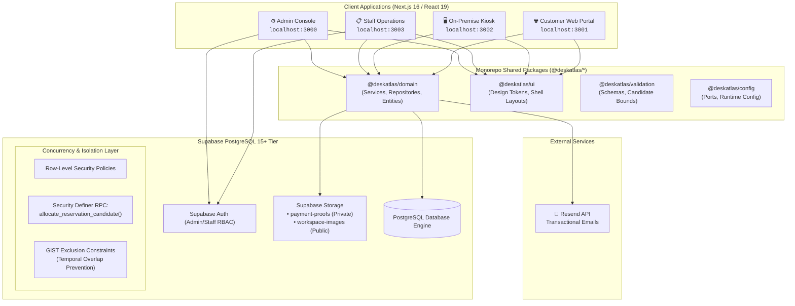

# DeskAtlas

<p align="center">
  <picture>
    <source media="(prefers-color-scheme: dark)" srcset="https://raw.githubusercontent.com/deskatlas/deskatlas/main/assets/logo-dark.png">
    
  </picture>
</p>

<p align="center">
  <strong>Server-authoritative, zero-inventory-hold coworking space reservation and operations management platform.</strong>
</p>

<p align="center">
  <a href="#test-suite"></a>
  <a href="#tech-stack"></a>
  <a href="#tech-stack"></a>
  <a href="#tech-stack"></a>
  <a href="#tech-stack"></a>
  <a href="#tech-stack"></a>
  <a href="#license"></a>
</p>

---

## Table of Contents

- [Overview](#overview)
- [The Core Innovation: Zero-Inventory-Hold Engine](#the-core-innovation-zero-inventory-hold-engine)
- [System Architecture](#system-architecture)
- [Multi-Portal Suite](#multi-portal-suite)
- [Monorepo Structure](#monorepo-structure)
- [Technology Stack](#technology-stack)
- [Core Domain Invariants](#core-domain-invariants)
- [Prerequisites](#prerequisites)
- [Quickstart & Getting Started](#quickstart--getting-started)
- [Environment Variables](#environment-variables)
- [Database Setup & Migrations](#database-setup--migrations)
- [Testing & Quality Assurance](#testing--quality-assurance)
- [Authoritative Documentation Index](#authoritative-documentation-index)
- [Contributing & Development Workflow](#contributing--development-workflow)
- [License & Acknowledgments](#license--acknowledgments)

---

## Overview

**DeskAtlas** is a production-grade, enterprise-ready coworking space operations and reservation ecosystem. Traditional reservation systems suffer catastrophic inventory starvation in manual-payment economies (e.g., Southeast Asian markets utilizing **GCash**, **Maya**, and manual bank transfers) because they lock inventory while awaiting proof verification. If a guest fails to pay or abandons the transaction, physical desks remain unbookable for hours.

DeskAtlas eliminates inventory locking entirely:
- **Guest-First Discovery:** Customers explore live 2D floor plans rendered with HTML5 Canvas (`Konva`), selecting desired workspace templates and specific desks without requiring account creation.
- **Multi-Candidate Reservations:** Customers select a **Main candidate** and up to **two alternative backup candidates** (differing by desk or start time) under the same template, date, and duration.
- **Atomic Zero-Hold Allocation:** Neither browsing, submitting, nor uploading payment proof holds inventory. Desks are committed **only upon administrative or front-desk payment approval** using an atomic PostgreSQL Security Definer transaction (`allocate_reservation_candidate`).
- **Opaque QR Access Control:** Confirmed reservations receive a cryptographically opaque QR code that activates exclusively during the confirmed booking window, supporting multi-entry check-in and re-entry via camera scanners.

---

## The Core Innovation: Zero-Inventory-Hold Engine

```
[Customer Selects Candidates]
       │ (Main + Alt 1 + Alt 2)
       ▼
[Submits Reservation] ─────────────► Inventory remains 100% UNLOCKED & bookable by others
       │
       ▼
[60-Min Payment Window] ───────────► Submits GCash / Maya / Bank Transfer Receipt
       │
       ▼
[Staff / Admin Review Queue] ──────► Verifies Payment Authenticity
       │
       ▼
[Atomic Allocation RPC] ───────────► Locks Candidate 1? ──► [SUCCESS: CONFIRMED]
       │                                  │ (Collision detected)
       │                                  ▼
       │                             Locks Candidate 2? ──► [SUCCESS: CONFIRMED]
       │                                  │ (Collision detected)
       │                                  ▼
       │                             Locks Candidate 3? ──► [SUCCESS: CONFIRMED]
       │                                  │ (All collide)
       ▼                                  ▼
[Allocation Exhausted] ────────────► [FAILED_ALLOCATION ──► Manual Resolution Queue]
```

1. **No-Hold Guarantee:** Submitting a reservation, receiving a payment link, or waiting in review **never** decrements seat availability.
2. **First Approved Wins:** Concurrently submitted reservations for the same desk compete fairly; the first reservation whose payment is reviewed and confirmed claims the desk.
3. **Automatic Fallback:** If the primary desk was claimed while payment was in review, the PostgreSQL allocation engine instantly attempts Alternative 1, followed by Alternative 2, in a single atomic database transaction with `btree_gist` temporal exclusion locks.
4. **Zero Double-Bookings:** Physical desks are enforced at the PostgreSQL engine level using exclusion constraints:
   ```sql
   ALTER TABLE reservations
   ADD CONSTRAINT no_overlapping_confirmed_bookings
   EXCLUDE USING gist (
     physical_workspace_id WITH =,
     tstzrange(start_time, end_time, '[)') WITH &&
   )
   WHERE (status = 'CONFIRMED');
   ```

---

## System Architecture



---

## Multi-Portal Suite

The monorepo contains four specialized frontend applications, each tailored for a distinct operational persona:

| Application | Port | Target Audience | Primary Responsibilities |
|---|---|---|---|
| **`apps/customer-website`** | `3001` | Public Guests & Remote Coworkers | • Interactive Konva floor map exploration<br>• Template-first booking selection<br>• Multi-candidate reservation submission (Main + 2 Alts)<br>• 60-minute payment countdown session & proof upload<br>• Booking lookup by reference code<br>• Opaque QR access pass view |
| **`apps/kiosk`** | `3002` | Walk-in Customers at Front Desk | • High-resolution touchscreen UI with idle timeout resets<br>• "Now Reserve" immediate-start booking flow<br>• "You Are Here" spatial orientation markers<br>• Cash & counter-QR instant token generation |
| **`apps/staff-dashboard`** | `3003` | Front-Desk Operators & Concierge | • Real-time daily occupancy roster<br>• Physical camera QR scanner (`html5-qrcode`)<br>• Instant check-in & re-entry validation<br>• Kiosk counter cash payment verification queue<br>• Floor map occupancy inspection |
| **`apps/admin-portal`** | `3000` | Space Managers & Facility Admins | • 2D Konva Floor Plan Designer with collision & snap-to-grid<br>• Multi-version draft/publish map pipeline<br>• Workspace template & physical desk inventory management<br>• Online payment review & atomic allocation queue<br>• Operating hours, holidays, and emergency closure management<br>• Staff user lifecycle & RBAC provisioning<br>• Financial and occupancy analytics with `.xlsx` and CSV export |

---

## Monorepo Structure

DeskAtlas is organized as a high-performance **pnpm workspace** adhering to clean architecture principles:

```text
deskatlas/
├── apps/
│   ├── admin-portal/          # Next.js 16 back-office administration console (:3000)
│   ├── customer-website/      # Next.js 16 public guest discovery & booking app (:3001)
│   ├── kiosk/                 # Next.js 16 self-service touchscreen kiosk (:3002)
│   └── staff-dashboard/       # Next.js 16 front-desk operations & QR scanning (:3003)
├── packages/
│   ├── domain/                # Shared business logic, repositories, and Supabase client
│   ├── ui/                    # Design tokens, shared layouts, and atomic CSS utilities
│   ├── validation/            # Zod validation schemas & reservation candidate bounds
│   └── config/                # Shared runtime configuration & network port constants
├── supabase/
│   └── migrations/            # Version-controlled PostgreSQL schemas, RLS, and RPCs
├── tests/
│   ├── t01-workspace-catalog.test.ts
│   ├── t02-map-persistence-geometry.test.ts
│   ├── t03-availability-business-hours.test.ts
│   ├── t04-reservation-validation-candidates.test.ts
│   ├── t05-payment-session-and-review.test.ts
│   ├── t06-booking-access-and-qr.test.ts
│   ├── t07-kiosk-reservation-flow.test.ts
│   ├── t08-staff-operations.test.ts
│   ├── t09-guest-tracking-and-emails.test.ts
│   ├── t10-reports-and-analytics.test.ts
│   ├── t11-auth-and-security.test.ts
│   └── t12-customer-reserve-ui-integration.test.ts
├── scripts/
│   ├── bootstrap-admin.ts     # Initial administrative user creation script
│   └── bootstrap-staff.ts     # Initial staff member creation script
├── docs/                      # Authoritative specifications and architectural documents
├── .env.example               # Template environment configuration
├── pnpm-workspace.yaml        # Workspace package topology
├── package.json               # Root scripts, dev tooling, and dependencies
├── tsconfig.json              # Base TypeScript configuration
└── vitest.config.mts          # Monorepo test runner configuration
```

---

## Technology Stack

### Frontend Layer
- **Framework:** Next.js 16.3.2 (App Router architecture, React Server Components)
- **UI Library:** React 19.2.8
- **Canvas / 2D Map Rendering:** Konva & `react-konva` (hardware-accelerated HTML5 Canvas with draggable objects, snap-to-grid, and structural wall collision detection)
- **Styling & Design System:** Custom Vanilla CSS with scoped design tokens (HSL color palettes, elevation shadows, glassmorphism, responsive grid layouts; strict avoidance of bloated CSS frameworks)
- **Hardware Integration:** `html5-qrcode` for camera-based QR code decoding
- **Icons & Visuals:** `lucide-react`

### Backend, Persistence & Security Layer
- **Database Engine:** Supabase PostgreSQL 15+
- **Security & Authorization:** Row-Level Security (RLS) policies enforcing role segregation between `admin`, `staff`, and public `anon` roles
- **Concurrency & Integrity:** PL/pgSQL Stored Procedures (`allocate_reservation_candidate`) executing with `SECURITY DEFINER` privilege; `btree_gist` temporal exclusion constraints preventing double-bookings
- **Object Storage:** Supabase Storage with dedicated buckets:
  - `workspace-images` (Public CDN for floor plans and workspace thumbnails)
  - `payment-proofs` (Private bucket with authenticated pre-signed URL generation)
- **Data Export Engine:** `exceljs` for multi-tab `.xlsx` reporting and streaming CSV generation

### Domain & Communication
- **Architecture:** Pure TypeScript Domain-Driven Design (DDD) with Repository & Service patterns (`@deskatlas/domain`)
- **Transactional Emails:** Resend API integration for payment receipt confirmations, reference tracking, and access pass delivery

---

## Core Domain Invariants

The DeskAtlas platform strictly enforces the following non-negotiable architectural rules:

1. **Guest-First (No Customer Password Accounts):**
   - Customers book as unauthenticated guests requiring only first name, last name, and email.
   - Customers track their booking status via an opaque 10-character reference code (e.g., `DA-XXXX-XXXX`).
2. **Candidate Priority Order (`Main -> Alt 1 -> Alt 2`):**
   - Exactly 1 Main candidate and up to 2 alternative candidates.
   - Alternatives **must** share the identical workspace template, date, and duration.
   - Candidates may specify different physical desks or different start times on the same desk. Duplicate desk + identical start time combinations are strictly rejected.
3. **No-Hold Principle:**
   - Browsing, selecting seats, initiating checkout, and uploading payment receipts **do not reserve or lock inventory**.
   - Physical desks are committed solely upon authorized staff/admin approval.
4. **Opaque Booking QR Passes:**
   - QR codes contain an unguessable opaque cryptographic token. No PII (names, emails, phones) is encoded in the QR payload.
   - Passes are time-bound: active strictly during the confirmed start and end time.
   - Passes support multiple check-ins and re-entries during valid hours.
5. **Separation of Concerns:**
   - Kiosk terminals create immediate-start walk-in reservations paid at the front-desk counter with cash or terminal QR.
   - Online reservations enforce a 60-minute payment expiration window with uploadable bank/GCash slips.

---

## Prerequisites

Before running DeskAtlas, ensure your local environment satisfies:

- **Node.js:** `>= 20.10.0` (LTS recommended)
- **Package Manager:** `pnpm >= 9.15.0` (Enabled via Corepack)
- **Database:** Local or Cloud Supabase PostgreSQL instance (PostgreSQL 15+)

---

## Quickstart & Getting Started

### 1. Clone the Repository

```bash
git clone https://github.com/deskatlas/deskatlas.git
cd deskatlas
```

### 2. Enable Corepack & Install Dependencies

```bash
corepack enable
corepack prepare pnpm@9.15.0 --activate
pnpm install
```

### 3. Configure Environment Variables

Copy the template configuration and supply your Supabase and Resend credentials:

```bash
cp .env.example .env.local
```

*(Refer to the [Environment Variables](#environment-variables) section below for detailed definitions.)*

### 4. Apply Database Migrations & Seeds

Execute the SQL migrations found in `supabase/migrations/` against your Supabase database in sequential order, or run:

```bash
supabase db reset
```

### 5. Bootstrap Administrative and Staff Accounts

Initialize the system with default privileged credentials:

```bash
# Seed initial administrator account
pnpm seed:admin

# Seed initial staff member account
pnpm seed:staff
```

### 6. Start Development Servers

Run all four applications in parallel:

```bash
pnpm dev
```

Or run any application individually:

```bash
pnpm dev:admin     # http://localhost:3000
pnpm dev:customer  # http://localhost:3001
pnpm dev:kiosk     # http://localhost:3002
pnpm dev:staff     # http://localhost:3003
```

---

## Environment Variables

DeskAtlas uses a centralized root configuration (`.env.local`) shared across packages and apps.

| Variable Name | Required | Default / Example | Scope | Description |
|---|---|---|---|---|
| `NEXT_PUBLIC_SUPABASE_URL` | **Yes** | `https://xyzcompany.supabase.co` | Public / Client | Supabase Project API gateway URL |
| `SUPABASE_URL` | **Yes** | `https://xyzcompany.supabase.co` | Server-Only | Supabase URL for backend server-side client |
| `SUPABASE_SERVICE_ROLE_KEY` | **Yes** | `eyJh...` | Server-Only | High-privilege key for atomic RPCs & admin actions. **Never expose to client.** |
| `ADMIN_EMAIL` | Optional | `admin@deskatlas.com` | Server-Only | Email for `pnpm seed:admin` script |
| `ADMIN_PASSWORD` | Optional | `AdminPassword123!` | Server-Only | Secure password for initial admin user |
| `ADMIN_DISPLAY_NAME` | Optional | `"Admin User"` | Server-Only | Full display name for initial admin |
| `RESEND_API_KEY` | Optional | `re_123456789` | Server-Only | Resend API key for transactional emails |
| `RESEND_FROM_EMAIL` | Optional | `bookings@deskatlas.com` | Server-Only | Verified sender email address |
| `TRANSACTIONAL_EMAIL_WEBHOOK_URL` | Optional | `https://...` | Server-Only | Webhook URL for asynchronous delivery receipts |

---

## Database Setup & Migrations

DeskAtlas database schemas are located in `supabase/migrations/`. Key database assets include:

- `001_initial_schema.sql`: Core domain tables (`workspace_templates`, `physical_workspaces`, `floor_plans`, `reservations`, `reservation_candidates`, `payment_sessions`, `access_passes`).
- `002_concurrency_and_gist.sql`: Installation of `btree_gist` extension and temporal exclusion constraints preventing overlapping confirmed reservations.
- `003_allocation_rpc.sql`: The atomic `allocate_reservation_candidate` stored procedure managing candidate cascading (`Main -> Alt 1 -> Alt 2`).
- `004_rls_and_storage.sql`: Row-Level Security policies restricting private payment proof reads to authenticated staff/admins and configuring public workspace asset buckets.

---

## Testing & Quality Assurance

DeskAtlas enforces 100% pass criteria across its automated test suites before any feature milestone is certified.

```bash
# Execute full test suite
pnpm test

# Run tests in interactive watch mode
pnpm test:watch

# Generate V8 coverage report
pnpm test:coverage
```

### Comprehensive Test Matrix (Vitest 5.0.0)

| Suite File | Domain Area Covered | Verifications / Assertions |
|---|---|---|
| `tests/t01-workspace-catalog.test.ts` | Catalog & Templates | Workspace template lifecycle, amenity tags, active pricing tiers |
| `tests/t02-map-persistence-geometry.test.ts` | Floor Plan Engine | Konva canvas JSON serialisation, desk coordinates, draft vs. published state |
| `tests/t03-availability-business-hours.test.ts` | Scheduling & Operating Hours | Opening hours, holiday blackouts, operational boundary restrictions |
| `tests/t04-reservation-validation-candidates.test.ts` | Reservation Validation | Candidate rank hierarchy (`Main`, `Alt 1`, `Alt 2`), duration bounds, anti-duplicate rules |
| `tests/t05-payment-session-and-review.test.ts` | Payment State Machine | 60-min payment session expiry, proof upload, admin review queue transitions |
| `tests/t06-booking-access-and-qr.test.ts` | QR Code Access Passes | Opaque token generation, time-window gating, re-entry authorization |
| `tests/t07-kiosk-reservation-flow.test.ts` | Walk-In Kiosk Operations | Immediate-start flow, counter payment generation, session timeout handling |
| `tests/t08-staff-operations.test.ts` | Staff Front-Desk Actions | Camera QR scan validation, roster filtering, cash payment approval |
| `tests/t09-guest-tracking-and-emails.test.ts` | Guest Comms & Tracking | Reference code lookup, Resend email payload formatting, anonymised PII |
| `tests/t10-reports-and-analytics.test.ts` | Business Intelligence | Occupancy calculation, Excel (`.xlsx`) sheet generation, CSV export |
| `tests/t11-auth-and-security.test.ts` | RBAC & Security Boundaries | Supabase Auth validation, Staff vs. Admin permissions, RLS isolation |
| `tests/t12-customer-reserve-ui-integration.test.ts` | End-to-End Integration | Multi-candidate booking UI workflow, payload sanitisation, state continuity |

### Static Code Analysis

```bash
# TypeScript strict type checking across all apps & packages
pnpm typecheck

# Code formatting and linting
pnpm lint

# Production build verification
pnpm build
```

---

## Authoritative Documentation Index

All locked architectural decisions, PRD requirements, and database specifications are cataloged in `/docs`:

1. **[`docs/DeskAtlas_Final_Source_of_Truth_Project_Plan.md`](docs/DeskAtlas_Final_Source_of_Truth_Project_Plan.md):** The primary source of truth for locked business workflows, rules, and invariants.
2. **[`docs/prd-deskatlas.md`](docs/prd-deskatlas.md):** Comprehensive Product Requirements Document defining user stories and acceptance criteria.
3. **[`docs/DeskAtlas_Final_ERD_Specification.md`](docs/DeskAtlas_Final_ERD_Specification.md):** Authoritative database entity-relationship specification, constraints, and keys.
4. **[`DeskAtlas_Project_Documentation_Agent_Template.md`](DeskAtlas_Project_Documentation_Agent_Template.md):** Complete 1,800+ line as-built technical reference manual.
5. **[`DeskAtlas_Technical_Defense_Handbook_AS_BUILT.md`](DeskAtlas_Technical_Defense_Handbook_AS_BUILT.md):** Capstone oral defense, architectural trade-offs, and system rationale handbook.
6. **[`docs/INDEX.md`](docs/INDEX.md):** Master index of milestone documentation, bugfix logs (`MF-*`), and architectural decisions.

---

## Contributing & Development Workflow

To maintain production stability and data integrity, all contributors must observe the following engineering practices:

1. **Strict Milestone Discipline:** Follow the single-milestone lifecycle:
   $$\text{Read} \longrightarrow \text{Inspect} \longrightarrow \text{Plan} \longrightarrow \text{Implement} \longrightarrow \text{Test} \longrightarrow \text{Diff Audit} \longrightarrow \text{Stop}$$
2. **Branching Strategy:**
   - Feature branches: `feat/<feature-name>`
   - Bugfix branches: `fix/<issue-name>`
   - Main branches: `dev` (integration), `main` (production-ready)
3. **Pre-Commit Verification:** Always ensure `pnpm typecheck` and `pnpm test` pass before committing.

---

## License & Acknowledgments

- **License:** Distributed under the [MIT License](LICENSE).
- **Engineered By:** The DeskAtlas Core Engineering Team & Capstone System Architects.
- **Special Thanks:** Built with Next.js, Supabase, Konva, and React.
