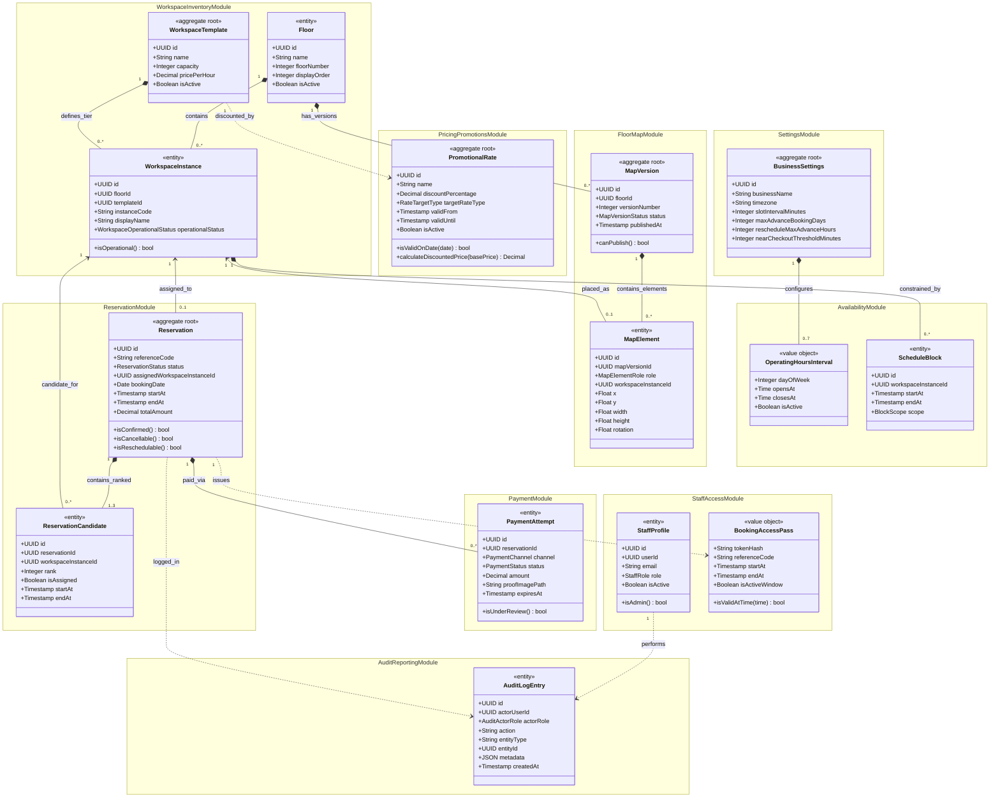

# DeskAtlas - Master Architecture Class Diagram

This diagram displays the high-level package architecture, aggregate roots, and cross-module relationships across the DeskAtlas domain.

```mermaid
classDiagram
    direction TB

    %% Packages / Bounded Contexts
    namespace ReservationModule {
        class Reservation {
            <<aggregate root>>
            +UUID id
            +String referenceCode
            +ReservationStatus status
            +UUID assignedWorkspaceInstanceId
            +Date bookingDate
            +Timestamp startAt
            +Timestamp endAt
            +Decimal totalAmount
            +isConfirmed() bool
            +isCancellable() bool
            +isReschedulable() bool
        }
        class ReservationCandidate {
            <<entity>>
            +UUID id
            +UUID reservationId
            +UUID workspaceInstanceId
            +Integer rank
            +Boolean isAssigned
            +Timestamp startAt
            +Timestamp endAt
        }
    }

    namespace WorkspaceInventoryModule {
        class Floor {
            <<entity>>
            +UUID id
            +String name
            +Integer floorNumber
            +Integer displayOrder
            +Boolean isActive
        }
        class WorkspaceTemplate {
            <<aggregate root>>
            +UUID id
            +String name
            +Integer capacity
            +Decimal pricePerHour
            +Boolean isActive
        }
        class WorkspaceInstance {
            <<entity>>
            +UUID id
            +UUID floorId
            +UUID templateId
            +String instanceCode
            +String displayName
            +WorkspaceOperationalStatus operationalStatus
            +isOperational() bool
        }
    }

    namespace FloorMapModule {
        class MapVersion {
            <<aggregate root>>
            +UUID id
            +UUID floorId
            +Integer versionNumber
            +MapVersionStatus status
            +Timestamp publishedAt
            +canPublish() bool
        }
        class MapElement {
            <<entity>>
            +UUID id
            +UUID mapVersionId
            +MapElementRole role
            +UUID workspaceInstanceId
            +Float x
            +Float y
            +Float width
            +Float height
            +Float rotation
        }
    }

    namespace AvailabilityModule {
        class OperatingHoursInterval {
            <<value object>>
            +Integer dayOfWeek
            +Time opensAt
            +Time closesAt
            +Boolean isActive
        }
        class ScheduleBlock {
            <<entity>>
            +UUID id
            +UUID workspaceInstanceId
            +Timestamp startAt
            +Timestamp endAt
            +BlockScope scope
        }
    }

    namespace PricingPromotionsModule {
        class PromotionalRate {
            <<aggregate root>>
            +UUID id
            +String name
            +Decimal discountPercentage
            +RateTargetType targetRateType
            +Timestamp validFrom
            +Timestamp validUntil
            +Boolean isActive
            +isValidOnDate(date) bool
            +calculateDiscountedPrice(basePrice) Decimal
        }
    }

    namespace PaymentModule {
        class PaymentAttempt {
            <<entity>>
            +UUID id
            +UUID reservationId
            +PaymentChannel channel
            +PaymentStatus status
            +Decimal amount
            +String proofImagePath
            +Timestamp expiresAt
            +isUnderReview() bool
        }
    }

    namespace StaffAccessModule {
        class StaffProfile {
            <<entity>>
            +UUID id
            +UUID userId
            +String email
            +StaffRole role
            +Boolean isActive
            +isAdmin() bool
        }
        class BookingAccessPass {
            <<value object>>
            +String tokenHash
            +String referenceCode
            +Timestamp startAt
            +Timestamp endAt
            +Boolean isActiveWindow
            +isValidAtTime(time) bool
        }
    }

    namespace SettingsModule {
        class BusinessSettings {
            <<aggregate root>>
            +UUID id
            +String businessName
            +String timezone
            +Integer slotIntervalMinutes
            +Integer maxAdvanceBookingDays
            +Integer rescheduleMaxAdvanceHours
            +Integer nearCheckoutThresholdMinutes
        }
    }

    namespace AuditReportingModule {
        class AuditLogEntry {
            <<entity>>
            +UUID id
            +UUID actorUserId
            +AuditActorRole actorRole
            +String action
            +String entityType
            +UUID entityId
            +JSON metadata
            +Timestamp createdAt
        }
    }

    %% Inter-Module Relationships
    Floor "1" *-- "0..*" WorkspaceInstance : contains
    WorkspaceTemplate "1" *-- "0..*" WorkspaceInstance : defines_tier
    Floor "1" *-- "0..*" MapVersion : has_versions
    MapVersion "1" *-- "0..*" MapElement : contains_elements
    WorkspaceInstance "1" <-- "0..1" MapElement : placed_as

    Reservation "1" *-- "1..3" ReservationCandidate : contains_ranked
    WorkspaceInstance "1" <-- "0..*" ReservationCandidate : candidate_for
    WorkspaceInstance "1" <-- "0..1" Reservation : assigned_to

    Reservation "1" *-- "0..*" PaymentAttempt : paid_via
    Reservation "1" ..> BookingAccessPass : issues

    WorkspaceInstance "1" *-- "0..*" ScheduleBlock : constrained_by
    WorkspaceTemplate "1" ..> PromotionalRate : discounted_by
    BusinessSettings "1" *-- "0..7" OperatingHoursInterval : configures

    StaffProfile "1" ..> AuditLogEntry : performs
    Reservation ..> AuditLogEntry : logged_in
```
