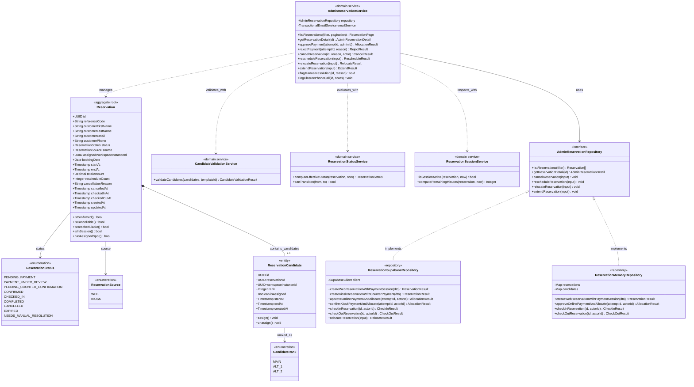

# DeskAtlas - Reservation & Allocation Module Class Diagram

Detailed domain model for guest booking lifecycle, multi-candidate priority ranking, atomic allocation, and repository implementations.

