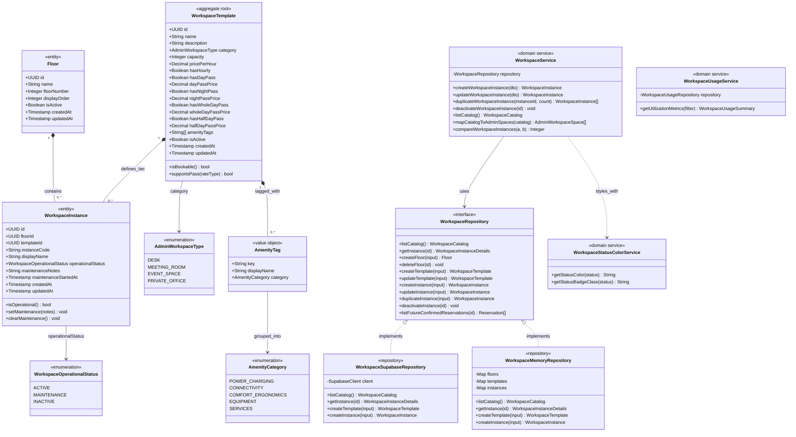

# DeskAtlas - Workspace & Inventory Module Class Diagram

Floor hierarchies, workspace templates (tiers), physical desk instances, capacity limits, and operational maintenance states.

```mermaid
classDiagram
    direction TB

    class WorkspaceOperationalStatus {
        <<enumeration>>
        ACTIVE
        MAINTENANCE
        INACTIVE
    }

    class AdminWorkspaceType {
        <<enumeration>>
        DESK
        MEETING_ROOM
        EVENT_SPACE
        PRIVATE_OFFICE
    }

    class AmenityCategory {
        <<enumeration>>
        POWER_CHARGING
        CONNECTIVITY
        COMFORT_ERGONOMICS
        EQUIPMENT
        SERVICES
    }

    class AmenityTag {
        <<value object>>
        +String key
        +String displayName
        +AmenityCategory category
    }

    class Floor {
        <<entity>>
        +UUID id
        +String name
        +Integer floorNumber
        +Integer displayOrder
        +Boolean isActive
        +Timestamp createdAt
        +Timestamp updatedAt
    }

    class WorkspaceTemplate {
        <<aggregate root>>
        +UUID id
        +String name
        +String description
        +AdminWorkspaceType category
        +Integer capacity
        +Decimal pricePerHour
        +Boolean hasHourly
        +Boolean hasDayPass
        +Decimal dayPassPrice
        +Boolean hasNightPass
        +Decimal nightPassPrice
        +Boolean hasWholeDayPass
        +Decimal wholeDayPassPrice
        +Boolean hasHalfDayPass
        +Decimal halfDayPassPrice
        +String[] amenityTags
        +Boolean isActive
        +Timestamp createdAt
        +Timestamp updatedAt
        +isBookable() bool
        +supportsPass(rateType) bool
    }

    class WorkspaceInstance {
        <<entity>>
        +UUID id
        +UUID floorId
        +UUID templateId
        +String instanceCode
        +String displayName
        +WorkspaceOperationalStatus operationalStatus
        +String maintenanceNotes
        +Timestamp maintenanceStartedAt
        +Timestamp createdAt
        +Timestamp updatedAt
        +isOperational() bool
        +setMaintenance(notes) void
        +clearMaintenance() void
    }

    class WorkspaceService {
        <<domain service>>
        -WorkspaceRepository repository
        +createWorkspaceInstance(dto) WorkspaceInstance
        +updateWorkspaceInstance(dto) WorkspaceInstance
        +duplicateWorkspaceInstance(instanceId, count) WorkspaceInstance[]
        +deactivateWorkspaceInstance(id) void
        +listCatalog() WorkspaceCatalog
        +mapCatalogToAdminSpaces(catalog) AdminWorkspaceSpace[]
        +compareWorkspaceInstances(a, b) Integer
    }

    class WorkspaceStatusColorService {
        <<domain service>>
        +getStatusColor(status) String
        +getStatusBadgeClass(status) String
    }

    class WorkspaceUsageService {
        <<domain service>>
        -WorkspaceUsageRepository repository
        +getUtilizationMetrics(filter) WorkspaceUsageSummary
    }

    class WorkspaceRepository {
        <<interface>>
        +listCatalog() WorkspaceCatalog
        +getInstance(id) WorkspaceInstanceDetails
        +createFloor(input) Floor
        +deleteFloor(id) void
        +createTemplate(input) WorkspaceTemplate
        +updateTemplate(input) WorkspaceTemplate
        +createInstance(input) WorkspaceInstance
        +updateInstance(input) WorkspaceInstance
        +duplicateInstance(input) WorkspaceInstance
        +deactivateInstance(id) void
        +listFutureConfirmedReservations(id) Reservation[]
    }

    class WorkspaceSupabaseRepository {
        <<repository>>
        -SupabaseClient client
        +listCatalog() WorkspaceCatalog
        +getInstance(id) WorkspaceInstanceDetails
        +createTemplate(input) WorkspaceTemplate
        +createInstance(input) WorkspaceInstance
    }

    class WorkspaceMemoryRepository {
        <<repository>>
        -Map floors
        -Map templates
        -Map instances
        +listCatalog() WorkspaceCatalog
        +getInstance(id) WorkspaceInstanceDetails
        +createTemplate(input) WorkspaceTemplate
        +createInstance(input) WorkspaceInstance
    }

    Floor "1" *-- "0..*" WorkspaceInstance : contains
    WorkspaceTemplate "1" *-- "0..*" WorkspaceInstance : defines_tier
    WorkspaceTemplate --> AdminWorkspaceType : category
    WorkspaceTemplate "1" *-- "0..*" AmenityTag : tagged_with
    AmenityTag --> AmenityCategory : grouped_into
    WorkspaceInstance --> WorkspaceOperationalStatus : operationalStatus

    WorkspaceService --> WorkspaceRepository : uses
    WorkspaceService ..> WorkspaceStatusColorService : styles_with
    WorkspaceRepository <|.. WorkspaceSupabaseRepository : implements
    WorkspaceRepository <|.. WorkspaceMemoryRepository : implements
```
