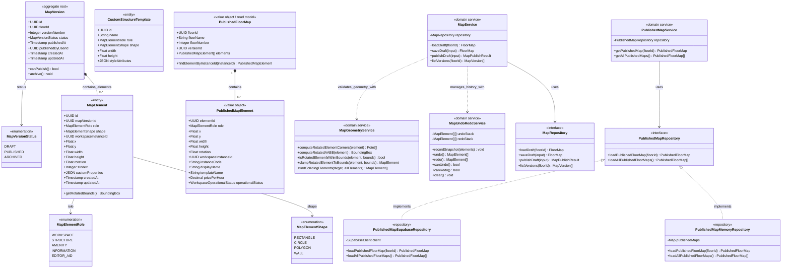

# DeskAtlas - Interactive Map & Geometry Module Class Diagram

Floorplan vector elements, Konva canvas coordinates, bounding box rotations, collision detection, and version publishing.

```mermaid
classDiagram
    direction TB

    class MapVersionStatus {
        <<enumeration>>
        DRAFT
        PUBLISHED
        ARCHIVED
    }

    class MapElementRole {
        <<enumeration>>
        WORKSPACE
        STRUCTURE
        AMENITY
        INFORMATION
        EDITOR_AID
    }

    class MapElementShape {
        <<enumeration>>
        RECTANGLE
        CIRCLE
        POLYGON
        WALL
    }

    class MapVersion {
        <<aggregate root>>
        +UUID id
        +UUID floorId
        +Integer versionNumber
        +MapVersionStatus status
        +Timestamp publishedAt
        +UUID publishedByUserId
        +Timestamp createdAt
        +Timestamp updatedAt
        +canPublish() bool
        +archive() void
    }

    class MapElement {
        <<entity>>
        +UUID id
        +UUID mapVersionId
        +MapElementRole role
        +MapElementShape shape
        +UUID workspaceInstanceId
        +Float x
        +Float y
        +Float width
        +Float height
        +Float rotation
        +Integer zIndex
        +JSON customProperties
        +Timestamp createdAt
        +Timestamp updatedAt
        +getRotatedBounds() BoundingBox
    }

    class CustomStructureTemplate {
        <<entity>>
        +UUID id
        +String name
        +MapElementRole role
        +MapElementShape shape
        +Float width
        +Float height
        +JSON styleAttributes
    }

    class PublishedFloorMap {
        <<value object / read model>>
        +UUID floorId
        +String floorName
        +Integer floorNumber
        +UUID versionId
        +PublishedMapElement[] elements
        +findElementByInstanceId(instanceId) PublishedMapElement
    }

    class PublishedMapElement {
        <<value object>>
        +UUID elementId
        +MapElementRole role
        +Float x
        +Float y
        +Float width
        +Float height
        +Float rotation
        +UUID workspaceInstanceId
        +String instanceCode
        +String displayName
        +String templateName
        +Decimal pricePerHour
        +WorkspaceOperationalStatus operationalStatus
    }

    class MapService {
        <<domain service>>
        -MapRepository repository
        +loadDraft(floorId) FloorMap
        +saveDraft(input) FloorMap
        +publishDraft(input) MapPublishResult
        +listVersions(floorId) MapVersion[]
    }

    class PublishedMapService {
        <<domain service>>
        -PublishedMapRepository repository
        +getPublishedMap(floorId) PublishedFloorMap
        +getAllPublishedMaps() PublishedFloorMap[]
    }

    class MapGeometryService {
        <<domain service>>
        +computeRotatedElementCorners(element) Point[]
        +computeRotatedAABB(element) BoundingBox
        +isRotatedElementWithinBounds(element, bounds) bool
        +clampRotatedElementToBounds(element, bounds) MapElement
        +findCollidingElements(target, allElements) MapElement[]
    }

    class MapUndoRedoService {
        <<domain service>>
        -MapElement[][] undoStack
        -MapElement[][] redoStack
        +recordSnapshot(elements) void
        +undo() MapElement[]
        +redo() MapElement[]
        +canUndo() bool
        +canRedo() bool
        +clear() void
    }

    class MapRepository {
        <<interface>>
        +loadDraft(floorId) FloorMap
        +saveDraft(input) FloorMap
        +publishDraft(input) MapPublishResult
        +listVersions(floorId) MapVersion[]
    }

    class PublishedMapRepository {
        <<interface>>
        +loadPublishedFloorMap(floorId) PublishedFloorMap
        +loadAllPublishedFloorMaps() PublishedFloorMap[]
    }

    class PublishedMapSupabaseRepository {
        <<repository>>
        -SupabaseClient client
        +loadPublishedFloorMap(floorId) PublishedFloorMap
        +loadAllPublishedFloorMaps() PublishedFloorMap[]
    }

    class PublishedMapMemoryRepository {
        <<repository>>
        -Map publishedMaps
        +loadPublishedFloorMap(floorId) PublishedFloorMap
        +loadAllPublishedFloorMaps() PublishedFloorMap[]
    }

    MapVersion "1" *-- "0..*" MapElement : contains_elements
    MapVersion --> MapVersionStatus : status
    MapElement --> MapElementRole : role
    MapElement --> MapElementShape : shape
    PublishedFloorMap "1" *-- "0..*" PublishedMapElement : contains

    MapService --> MapRepository : uses
    MapService ..> MapGeometryService : validates_geometry_with
    MapService ..> MapUndoRedoService : manages_history_with
    PublishedMapService --> PublishedMapRepository : uses

    PublishedMapRepository <|.. PublishedMapSupabaseRepository : implements
    PublishedMapRepository <|.. PublishedMapMemoryRepository : implements
```
