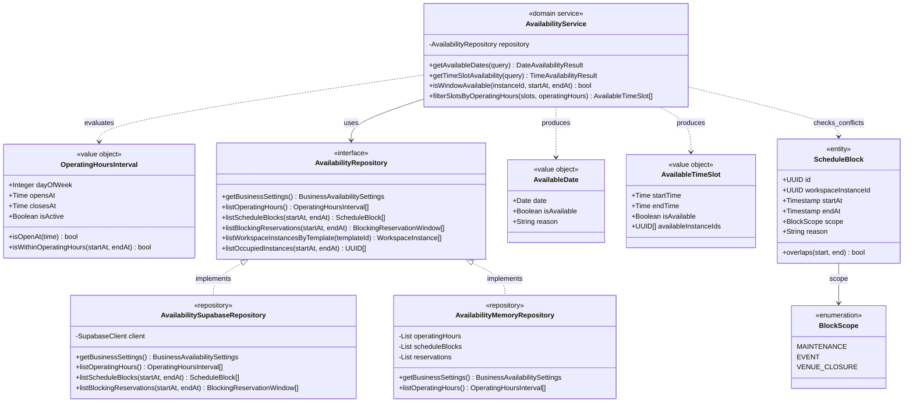

# DeskAtlas - Availability & Scheduling Module Class Diagram

Operating hours, closure schedules, schedule maintenance blocks, slot rounding, and real-time spot availability.

```mermaid
classDiagram
    direction TB

    class BlockScope {
        <<enumeration>>
        MAINTENANCE
        EVENT
        VENUE_CLOSURE
    }

    class OperatingHoursInterval {
        <<value object>>
        +Integer dayOfWeek
        +Time opensAt
        +Time closesAt
        +Boolean isActive
        +isOpenAt(time) bool
        +isWithinOperatingHours(startAt, endAt) bool
    }

    class ScheduleBlock {
        <<entity>>
        +UUID id
        +UUID workspaceInstanceId
        +Timestamp startAt
        +Timestamp endAt
        +BlockScope scope
        +String reason
        +overlaps(start, end) bool
    }

    class AvailableDate {
        <<value object>>
        +Date date
        +Boolean isAvailable
        +String reason
    }

    class AvailableTimeSlot {
        <<value object>>
        +Time startTime
        +Time endTime
        +Boolean isAvailable
        +UUID[] availableInstanceIds
    }

    class AvailabilityService {
        <<domain service>>
        -AvailabilityRepository repository
        +getAvailableDates(query) DateAvailabilityResult
        +getTimeSlotAvailability(query) TimeAvailabilityResult
        +isWindowAvailable(instanceId, startAt, endAt) bool
        +filterSlotsByOperatingHours(slots, operatingHours) AvailableTimeSlot[]
    }

    class AvailabilityRepository {
        <<interface>>
        +getBusinessSettings() BusinessAvailabilitySettings
        +listOperatingHours() OperatingHoursInterval[]
        +listScheduleBlocks(startAt, endAt) ScheduleBlock[]
        +listBlockingReservations(startAt, endAt) BlockingReservationWindow[]
        +listWorkspaceInstancesByTemplate(templateId) WorkspaceInstance[]
        +listOccupiedInstances(startAt, endAt) UUID[]
    }

    class AvailabilitySupabaseRepository {
        <<repository>>
        -SupabaseClient client
        +getBusinessSettings() BusinessAvailabilitySettings
        +listOperatingHours() OperatingHoursInterval[]
        +listScheduleBlocks(startAt, endAt) ScheduleBlock[]
        +listBlockingReservations(startAt, endAt) BlockingReservationWindow[]
    }

    class AvailabilityMemoryRepository {
        <<repository>>
        -List operatingHours
        -List scheduleBlocks
        -List reservations
        +getBusinessSettings() BusinessAvailabilitySettings
        +listOperatingHours() OperatingHoursInterval[]
    }

    ScheduleBlock --> BlockScope : scope
    AvailabilityService --> AvailabilityRepository : uses
    AvailabilityService ..> AvailableDate : produces
    AvailabilityService ..> AvailableTimeSlot : produces
    AvailabilityService ..> OperatingHoursInterval : evaluates
    AvailabilityService ..> ScheduleBlock : checks_conflicts

    AvailabilityRepository <|.. AvailabilitySupabaseRepository : implements
    AvailabilityRepository <|.. AvailabilityMemoryRepository : implements
```
