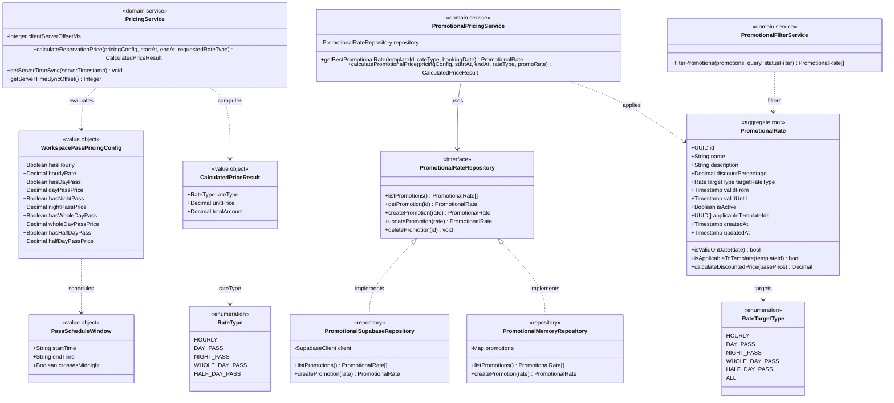

# DeskAtlas - Pricing & Promotions Module Class Diagram

Tariff structures, multi-pass schedule windows, PHT clock synchronization, and promotional discount campaigns.

```mermaid
classDiagram
    direction TB

    class RateType {
        <<enumeration>>
        HOURLY
        DAY_PASS
        NIGHT_PASS
        WHOLE_DAY_PASS
        HALF_DAY_PASS
    }

    class RateTargetType {
        <<enumeration>>
        HOURLY
        DAY_PASS
        NIGHT_PASS
        WHOLE_DAY_PASS
        HALF_DAY_PASS
        ALL
    }

    class PassScheduleWindow {
        <<value object>>
        +String startTime
        +String endTime
        +Boolean crossesMidnight
    }

    class WorkspacePassPricingConfig {
        <<value object>>
        +Boolean hasHourly
        +Decimal hourlyRate
        +Boolean hasDayPass
        +Decimal dayPassPrice
        +Boolean hasNightPass
        +Decimal nightPassPrice
        +Boolean hasWholeDayPass
        +Decimal wholeDayPassPrice
        +Boolean hasHalfDayPass
        +Decimal halfDayPassPrice
    }

    class CalculatedPriceResult {
        <<value object>>
        +RateType rateType
        +Decimal unitPrice
        +Decimal totalAmount
    }

    class PromotionalRate {
        <<aggregate root>>
        +UUID id
        +String name
        +String description
        +Decimal discountPercentage
        +RateTargetType targetRateType
        +Timestamp validFrom
        +Timestamp validUntil
        +Boolean isActive
        +UUID[] applicableTemplateIds
        +Timestamp createdAt
        +Timestamp updatedAt
        +isValidOnDate(date) bool
        +isApplicableToTemplate(templateId) bool
        +calculateDiscountedPrice(basePrice) Decimal
    }

    class PricingService {
        <<domain service>>
        -Integer clientServerOffsetMs
        +calculateReservationPrice(pricingConfig, startAt, endAt, requestedRateType) CalculatedPriceResult
        +setServerTimeSync(serverTimestamp) void
        +getServerTimeSyncOffset() Integer
    }

    class PromotionalPricingService {
        <<domain service>>
        -PromotionalRateRepository repository
        +getBestPromotionalRate(templateId, rateType, bookingDate) PromotionalRate
        +calculatePromotionalPrice(pricingConfig, startAt, endAt, rateType, promoRate) CalculatedPriceResult
    }

    class PromotionalFilterService {
        <<domain service>>
        +filterPromotions(promotions, query, statusFilter) PromotionalRate[]
    }

    class PromotionalRateRepository {
        <<interface>>
        +listPromotions() PromotionalRate[]
        +getPromotion(id) PromotionalRate
        +createPromotion(rate) PromotionalRate
        +updatePromotion(rate) PromotionalRate
        +deletePromotion(id) void
    }

    class PromotionalSupabaseRepository {
        <<repository>>
        -SupabaseClient client
        +listPromotions() PromotionalRate[]
        +createPromotion(rate) PromotionalRate
    }

    class PromotionalMemoryRepository {
        <<repository>>
        -Map promotions
        +listPromotions() PromotionalRate[]
        +createPromotion(rate) PromotionalRate
    }

    PromotionalRate --> RateTargetType : targets
    CalculatedPriceResult --> RateType : rateType
    WorkspacePassPricingConfig ..> PassScheduleWindow : schedules

    PricingService ..> WorkspacePassPricingConfig : evaluates
    PricingService ..> CalculatedPriceResult : computes
    PromotionalPricingService --> PromotionalRateRepository : uses
    PromotionalPricingService ..> PromotionalRate : applies
    PromotionalFilterService ..> PromotionalRate : filters

    PromotionalRateRepository <|.. PromotionalSupabaseRepository : implements
    PromotionalRateRepository <|.. PromotionalMemoryRepository : implements
```
