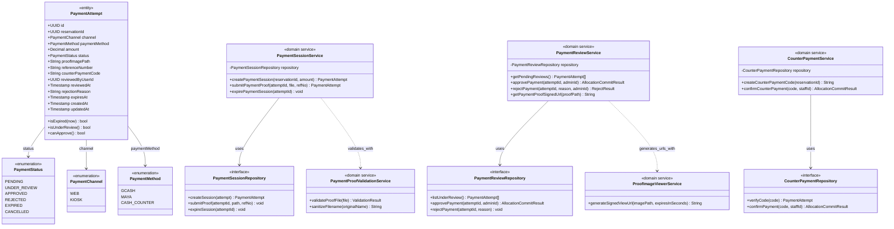

# DeskAtlas - Payment & Verification Module Class Diagram

Online payment sessions, countdown clocks, receipt proof ingestion into private S3 storage, and reception counter payments.

```mermaid
classDiagram
    direction TB

    class PaymentStatus {
        <<enumeration>>
        PENDING
        UNDER_REVIEW
        APPROVED
        REJECTED
        EXPIRED
        CANCELLED
    }

    class PaymentChannel {
        <<enumeration>>
        WEB
        KIOSK
    }

    class PaymentMethod {
        <<enumeration>>
        GCASH
        MAYA
        CASH_COUNTER
    }

    class PaymentAttempt {
        <<entity>>
        +UUID id
        +UUID reservationId
        +PaymentChannel channel
        +PaymentMethod paymentMethod
        +Decimal amount
        +PaymentStatus status
        +String proofImagePath
        +String referenceNumber
        +String counterPaymentCode
        +UUID reviewedByUserId
        +Timestamp reviewedAt
        +String rejectionReason
        +Timestamp expiresAt
        +Timestamp createdAt
        +Timestamp updatedAt
        +isExpired(now) bool
        +isUnderReview() bool
        +canApprove() bool
    }

    class PaymentSessionService {
        <<domain service>>
        -PaymentSessionRepository repository
        +createPaymentSession(reservationId, amount) PaymentAttempt
        +submitPaymentProof(attemptId, file, refNo) PaymentAttempt
        +expirePaymentSession(attemptId) void
    }

    class PaymentReviewService {
        <<domain service>>
        -PaymentReviewRepository repository
        +getPendingReviews() PaymentAttempt[]
        +approvePayment(attemptId, adminId) AllocationCommitResult
        +rejectPayment(attemptId, reason, adminId) RejectResult
        +getPaymentProofSignedUrl(proofPath) String
    }

    class CounterPaymentService {
        <<domain service>>
        -CounterPaymentRepository repository
        +createCounterPaymentCode(reservationId) String
        +confirmCounterPayment(code, staffId) AllocationCommitResult
    }

    class PaymentProofValidationService {
        <<domain service>>
        +validateProofFile(file) ValidationResult
        +sanitizeFilename(originalName) String
    }

    class ProofImageViewerService {
        <<domain service>>
        +generateSignedViewUrl(imagePath, expiresInSeconds) String
    }

    class PaymentSessionRepository {
        <<interface>>
        +createSession(attempt) PaymentAttempt
        +submitProof(attemptId, path, refNo) void
        +expireSession(attemptId) void
    }

    class PaymentReviewRepository {
        <<interface>>
        +listUnderReview() PaymentAttempt[]
        +approvePayment(attemptId, adminId) AllocationCommitResult
        +rejectPayment(attemptId, reason) void
    }

    class CounterPaymentRepository {
        <<interface>>
        +verifyCode(code) PaymentAttempt
        +confirmPayment(code, staffId) AllocationCommitResult
    }

    PaymentAttempt --> PaymentStatus : status
    PaymentAttempt --> PaymentChannel : channel
    PaymentAttempt --> PaymentMethod : paymentMethod

    PaymentSessionService --> PaymentSessionRepository : uses
    PaymentSessionService ..> PaymentProofValidationService : validates_with
    PaymentReviewService --> PaymentReviewRepository : uses
    PaymentReviewService ..> ProofImageViewerService : generates_urls_with
    CounterPaymentService --> CounterPaymentRepository : uses
```
