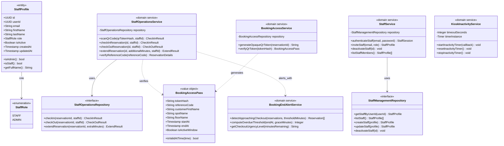

# DeskAtlas - Staff Operations & Access Control Module Class Diagram

Front-desk operations, WebRTC QR scanning, check-in/out, time extension, and session inactivity monitoring.

```mermaid
classDiagram
    direction TB

    class StaffRole {
        <<enumeration>>
        STAFF
        ADMIN
    }

    class StaffProfile {
        <<entity>>
        +UUID id
        +UUID userId
        +String email
        +String firstName
        +String lastName
        +StaffRole role
        +Boolean isActive
        +Timestamp createdAt
        +Timestamp updatedAt
        +isAdmin() bool
        +isStaff() bool
        +getFullName() String
    }

    class BookingAccessPass {
        <<value object>>
        +String tokenHash
        +String referenceCode
        +String customerFirstName
        +String spotName
        +String floorName
        +Timestamp startAt
        +Timestamp endAt
        +Boolean isActiveWindow
        +isValidAtTime(time) bool
    }

    class StaffOperationsService {
        <<domain service>>
        -StaffOperationsRepository repository
        +scanQrCode(qrTokenHash, staffId) CheckInResult
        +checkInReservation(id, staffId) CheckInResult
        +checkOutReservation(id, staffId) CheckOutResult
        +extendReservation(id, additionalMinutes, staffId) ExtendResult
        +verifyReferenceCode(referenceCode) ReservationDetails
    }

    class StaffService {
        <<domain service>>
        -StaffManagementRepository repository
        +authenticateStaff(email, password) StaffSession
        +inviteStaff(email, role) StaffProfile
        +deactivateStaff(id) void
        +listStaffMembers() StaffProfile[]
    }

    class BookingAccessService {
        <<domain service>>
        -BookingAccessRepository repository
        +generateOpaqueQrToken(reservationId) String
        +verifyQrToken(tokenHash) BookingAccessPass
    }

    class BookingEndAlertService {
        <<domain service>>
        +detectApproachingCheckout(reservations, thresholdMinutes) Reservation[]
        +computeOverdueThreshold(endAt, graceMinutes) Integer
        +getCheckoutUrgencyLevel(minutesRemaining) String
    }

    class KioskInactivityService {
        <<domain service>>
        -Integer timeoutSeconds
        -Timer timerInstance
        +startInactivityTimer(callback) void
        +resetInactivityTimer() void
        +stopInactivityTimer() void
    }

    class StaffOperationsRepository {
        <<interface>>
        +checkIn(reservationId, staffId) CheckInResult
        +checkOut(reservationId, staffId) CheckOutResult
        +extendReservation(reservationId, extraMinutes) ExtendResult
    }

    class StaffManagementRepository {
        <<interface>>
        +getStaffByUserId(userId) StaffProfile
        +listStaff() StaffProfile[]
        +createStaff(profile) StaffProfile
        +updateStaff(profile) StaffProfile
        +deactivateStaff(id) void
    }

    StaffProfile --> StaffRole : role
    StaffOperationsService --> StaffOperationsRepository : uses
    StaffOperationsService ..> BookingAccessPass : verifies
    StaffOperationsService ..> BookingEndAlertService : alerts_with
    StaffService --> StaffManagementRepository : uses
    BookingAccessService ..> BookingAccessPass : generates
```
