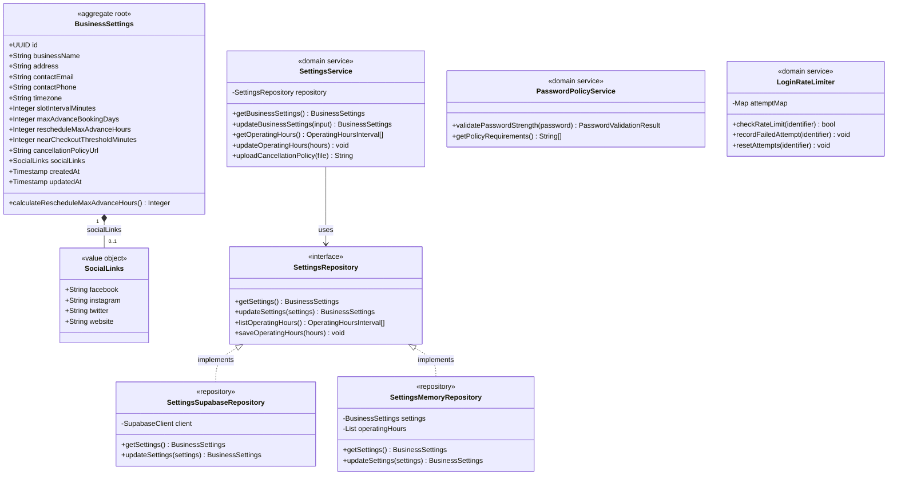

# DeskAtlas - Business Settings & Policy Module Class Diagram

Operating hours configuration, venue timezone, booking slot granularity, reschedule advance limits, and security password policies.

```mermaid
classDiagram
    direction TB

    class SocialLinks {
        <<value object>>
        +String facebook
        +String instagram
        +String twitter
        +String website
    }

    class BusinessSettings {
        <<aggregate root>>
        +UUID id
        +String businessName
        +String address
        +String contactEmail
        +String contactPhone
        +String timezone
        +Integer slotIntervalMinutes
        +Integer maxAdvanceBookingDays
        +Integer rescheduleMaxAdvanceHours
        +Integer nearCheckoutThresholdMinutes
        +String cancellationPolicyUrl
        +SocialLinks socialLinks
        +Timestamp createdAt
        +Timestamp updatedAt
        +calculateRescheduleMaxAdvanceHours() Integer
    }

    class SettingsService {
        <<domain service>>
        -SettingsRepository repository
        +getBusinessSettings() BusinessSettings
        +updateBusinessSettings(input) BusinessSettings
        +getOperatingHours() OperatingHoursInterval[]
        +updateOperatingHours(hours) void
        +uploadCancellationPolicy(file) String
    }

    class PasswordPolicyService {
        <<domain service>>
        +validatePasswordStrength(password) PasswordValidationResult
        +getPolicyRequirements() String[]
    }

    class LoginRateLimiter {
        <<domain service>>
        -Map attemptMap
        +checkRateLimit(identifier) bool
        +recordFailedAttempt(identifier) void
        +resetAttempts(identifier) void
    }

    class SettingsRepository {
        <<interface>>
        +getSettings() BusinessSettings
        +updateSettings(settings) BusinessSettings
        +listOperatingHours() OperatingHoursInterval[]
        +saveOperatingHours(hours) void
    }

    class SettingsSupabaseRepository {
        <<repository>>
        -SupabaseClient client
        +getSettings() BusinessSettings
        +updateSettings(settings) BusinessSettings
    }

    class SettingsMemoryRepository {
        <<repository>>
        -BusinessSettings settings
        -List operatingHours
        +getSettings() BusinessSettings
        +updateSettings(settings) BusinessSettings
    }

    BusinessSettings "1" *-- "0..1" SocialLinks : socialLinks
    SettingsService --> SettingsRepository : uses
    SettingsRepository <|.. SettingsSupabaseRepository : implements
    SettingsRepository <|.. SettingsMemoryRepository : implements
```
