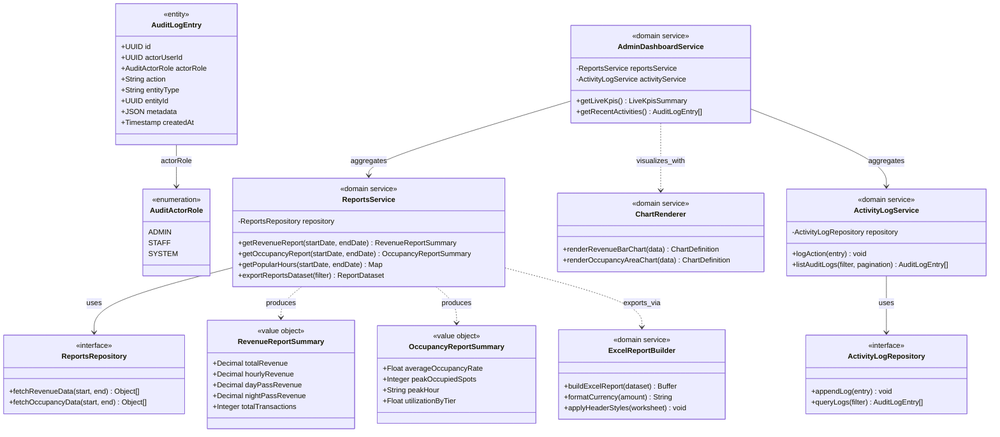

# DeskAtlas - Audit, Reporting & Analytics Module Class Diagram

Immutable administrative audit logs, occupancy trends, revenue aggregations, and Excel report generation.

```mermaid
classDiagram
    direction TB

    class AuditActorRole {
        <<enumeration>>
        ADMIN
        STAFF
        SYSTEM
    }

    class AuditLogEntry {
        <<entity>>
        +UUID id
        +UUID actorUserId
        +AuditActorRole actorRole
        +String action
        +String entityType
        +UUID entityId
        +JSON metadata
        +Timestamp createdAt
    }

    class RevenueReportSummary {
        <<value object>>
        +Decimal totalRevenue
        +Decimal hourlyRevenue
        +Decimal dayPassRevenue
        +Decimal nightPassRevenue
        +Integer totalTransactions
    }

    class OccupancyReportSummary {
        <<value object>>
        +Float averageOccupancyRate
        +Integer peakOccupiedSpots
        +String peakHour
        +Float utilizationByTier
    }

    class ReportsService {
        <<domain service>>
        -ReportsRepository repository
        +getRevenueReport(startDate, endDate) RevenueReportSummary
        +getOccupancyReport(startDate, endDate) OccupancyReportSummary
        +getPopularHours(startDate, endDate) Map
        +exportReportsDataset(filter) ReportDataset
    }

    class ExcelReportBuilder {
        <<domain service>>
        +buildExcelReport(dataset) Buffer
        +formatCurrency(amount) String
        +applyHeaderStyles(worksheet) void
    }

    class ChartRenderer {
        <<domain service>>
        +renderRevenueBarChart(data) ChartDefinition
        +renderOccupancyAreaChart(data) ChartDefinition
    }

    class AdminDashboardService {
        <<domain service>>
        -ReportsService reportsService
        -ActivityLogService activityService
        +getLiveKpis() LiveKpisSummary
        +getRecentActivities() AuditLogEntry[]
    }

    class ActivityLogService {
        <<domain service>>
        -ActivityLogRepository repository
        +logAction(entry) void
        +listAuditLogs(filter, pagination) AuditLogEntry[]
    }

    class ReportsRepository {
        <<interface>>
        +fetchRevenueData(start, end) Object[]
        +fetchOccupancyData(start, end) Object[]
    }

    class ActivityLogRepository {
        <<interface>>
        +appendLog(entry) void
        +queryLogs(filter) AuditLogEntry[]
    }

    AuditLogEntry --> AuditActorRole : actorRole
    ReportsService --> ReportsRepository : uses
    ReportsService ..> RevenueReportSummary : produces
    ReportsService ..> OccupancyReportSummary : produces
    AdminDashboardService --> ReportsService : aggregates
    AdminDashboardService --> ActivityLogService : aggregates
    AdminDashboardService ..> ChartRenderer : visualizes_with
    ReportsService ..> ExcelReportBuilder : exports_via
    ActivityLogService --> ActivityLogRepository : uses
```
