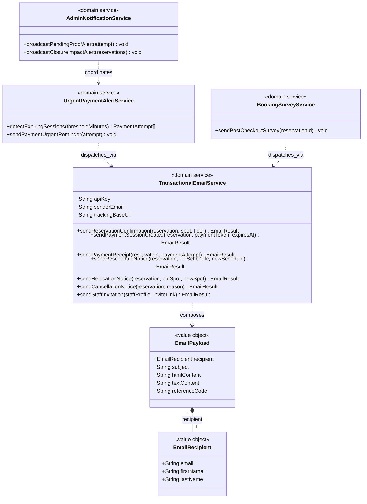

# DeskAtlas - Notifications & Communications Module Class Diagram

Transactional HTML emails (confirmation vouchers, countdown payment links, cancellation notices) and urgent operational alerts.

```mermaid
classDiagram
    direction TB

    class EmailRecipient {
        <<value object>>
        +String email
        +String firstName
        +String lastName
    }

    class EmailPayload {
        <<value object>>
        +EmailRecipient recipient
        +String subject
        +String htmlContent
        +String textContent
        +String referenceCode
    }

    class TransactionalEmailService {
        <<domain service>>
        -String apiKey
        -String senderEmail
        -String trackingBaseUrl
        +sendReservationConfirmation(reservation, spot, floor) EmailResult
        +sendPaymentSessionCreated(reservation, paymentToken, expiresAt) EmailResult
        +sendPaymentReceipt(reservation, paymentAttempt) EmailResult
        +sendRescheduleNotice(reservation, oldSchedule, newSchedule) EmailResult
        +sendRelocationNotice(reservation, oldSpot, newSpot) EmailResult
        +sendCancellationNotice(reservation, reason) EmailResult
        +sendStaffInvitation(staffProfile, inviteLink) EmailResult
    }

    class AdminNotificationService {
        <<domain service>>
        +broadcastPendingProofAlert(attempt) void
        +broadcastClosureImpactAlert(reservations) void
    }

    class UrgentPaymentAlertService {
        <<domain service>>
        +detectExpiringSessions(thresholdMinutes) PaymentAttempt[]
        +sendPaymentUrgentReminder(attempt) void
    }

    class BookingSurveyService {
        <<domain service>>
        +sendPostCheckoutSurvey(reservationId) void
    }

    EmailPayload "1" *-- "1" EmailRecipient : recipient
    TransactionalEmailService ..> EmailPayload : composes
    AdminNotificationService ..> UrgentPaymentAlertService : coordinates
    UrgentPaymentAlertService ..> TransactionalEmailService : dispatches_via
    BookingSurveyService ..> TransactionalEmailService : dispatches_via
```
